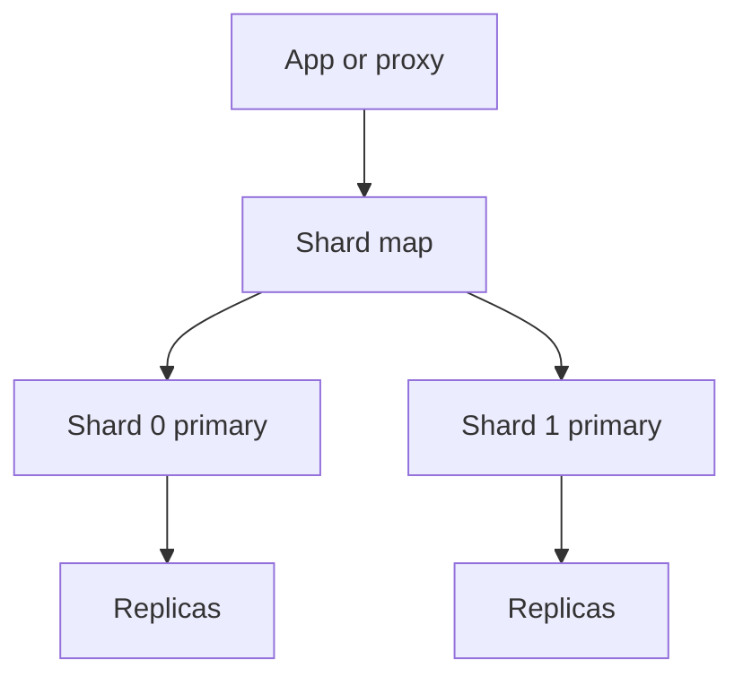

import { ConceptTemplate } from '@/features/kb/components/templates/ConceptTemplate'
import { Callout } from '@/features/kb/components/mdx/Callout'
import { ComparisonTable } from '@/features/kb/components/mdx/ComparisonTable'

export default function Layout({ children }) {
  return (
    <ConceptTemplate title="Sharding">
      {children}
    </ConceptTemplate>
  )
}

**Sharding** is partitioning a dataset across databases or clusters. Each shard is its own primary (plus replicas). You shard when one machine cannot store the rows or absorb the writes. You inherit every distributed-systems problem you were avoiding: resharding, cross-shard joins, and uneven keys.

## 1. Deep Dive and Mechanics

Pick a **shard key** that appears on the hot paths and has high cardinality. Route with a hash, a range, or a directory service. The application (or a proxy like Vitess or a Mongo cluster) owns the map.

**Resharding.** Split a hot shard, migrate with dual-write or vnode move, then cut reads. This is a project, not a config flag.

**Queries.** Point lookups by shard key are cheap. Global secondary indexes are another distributed system (or they live on every shard and you scatter). Cross-shard transactions need sagas or a distributed txn layer.

<Callout icon="warning" title="You cannot hide a bad key with more shards">
If 40 percent of writes are one tenant, 40 percent of writes stay on one shard. Isolate that tenant or split its key.
</Callout>

## 2. Mathematical / Theoretical Foundation

Capacity ~ number of shards if load is balanced. Imbalance is the ratio max_load / mean_load. Hashing helps; Zipf keys do not disappear.

Cross-shard txn abort probability rises with shards touched (more locks, more network). The design goal is one-shard transactions for the common path.

<ComparisonTable
  headers={['Approach', 'Routing', 'Reshard', 'Ops weight']}
  rows={[
    ['App-level hash', 'App modulo or ring', 'Painful', 'You own it'],
    ['Proxy (Vitess)', 'Vindex / keyspace', 'Planned workflows', 'Heavy but known'],
    ['Mongo / Cosmos shards', 'Cluster map', 'Splitter', 'Vendor rules'],
    ['Citus / Spanner', 'DB-aware', 'Built-in', 'SQL constraints'],
  ]}
/>

## 3. Real-World Implementation

```python
SHARDS = ['db-a', 'db-b', 'db-c']

def shard_name(tenant_id):
    return SHARDS[hash(tenant_id) % len(SHARDS)]

def with_shard(pool, tenant_id, fn):
    return fn(pool[shard_name(tenant_id)])
```

Never run a full-table query in a loop over shards on the user path without a budget. That is an accidental DDoS of your own fleet.

## 4. Visualizations



## 5. Interview Prep

**Q: When do you shard?**
**A:** When vertical scale and read replicas cannot hold writes or disk with 12–24 months of growth. Sharding earlier is optional complexity.

**Q: Shard key versus primary key?**
**A:** The primary key identifies a row. The shard key decides placement. They can match (user id) or not (order id sharded by customer id).

**Q: How do you do a global unique id?**
**A:** Snowflake-style (timestamp, worker, sequence) or UUIDv7. Do not ask a single sequence table after you sharded to escape that table.

## 6. Production Use Cases

- **Multi-tenant OLTP** with tenant id sharding and a few dedicated shards for whales.
- **Messaging inboxes** sharded by user id.
- **Inventory** sharded by warehouse plus SKU range.

<Callout icon="tip" title="Keep a dump-and-restore escape hatch">
The first reshard will be uglier than the slide. Practice moving one small shard in staging with production-shaped data.
</Callout>
