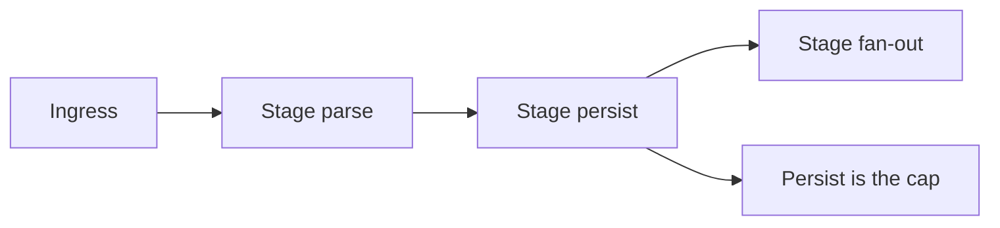

import { ConceptTemplate } from '@/features/kb/components/templates/ConceptTemplate'
import { Callout } from '@/features/kb/components/mdx/Callout'
import { ComparisonTable } from '@/features/kb/components/mdx/ComparisonTable'

export default function Layout({ children }) {
  return (
    <ConceptTemplate title="Throughput">
      {children}
    </ConceptTemplate>
  )
}

**Throughput** is completed units per second: requests, messages, or bytes. Latency is how long one unit takes. You can have high throughput and bad latency (huge batches) or low throughput and great latency (an idle luxury box). Design interviews that only quote latency have not sized the system.

## 1. Deep Dive and Mechanics

Throughput is limited by the **narrowest stage**: disk fsyncs, a single-threaded loop, a lock, or a downstream quota. Pipeline stages run in parallel; the slow stage sets the rate (Amdahl / theory of constraints).

**Batching** raises throughput by amortizing overhead (one fsync, one RPC, one TLS handshake) and usually raises latency. That trade is explicit in Kafka, in DB group commit, and in ML batch inference.

**Concurrency** raises throughput until you saturate a resource or until context-switch and lock contention eat the gain.

<Callout icon="info" title="Quote the unit">
QPS, records/s, and MiB/s are different systems. A 1 kQPS API of 10-byte pings is not a 1 kQPS API of 2 MiB uploads.
</Callout>

## 2. Mathematical / Theoretical Foundation

Little's law: throughput lambda = L / W. For a given concurrency L, cutting latency W raises throughput. For a given W, you need more L (more in-flight) to raise lambda — until a resource saturates.

Utilization rho = lambda / mu. As rho approaches 1, queues and latency explode, so usable throughput is less than theoretical mu if you have an SLO.

<ComparisonTable
  headers={['Lever', 'Throughput', 'Latency', 'Risk']}
  rows={[
    ['More replicas', 'Up', 'Flat if balanced', 'Shared dep'],
    ['Larger batches', 'Up', 'Up', 'Memory, delay'],
    ['More in-flight', 'Up then down', 'Up', 'Overload'],
    ['Cheaper payload', 'Up', 'Down', 'Product change'],
  ]}
/>

## 3. Real-World Implementation

```python
def records_per_sec(n_records, seconds):
    if seconds <= 0:
        return 0.0
    return n_records / seconds

# capacity test: raise concurrency until p99 SLO breaks; that QPS is the number
```

Report goodput (successful, valid) not accepted-then-500. Load generators that ignore errors will flatter you.

## 4. Visualizations



## 5. Interview Prep

**Q: How many servers for X QPS?**
**A:** Measure one server's goodput at the SLO, subtract headroom (usually 30–50 percent), divide. Then check the database, not only the app.

**Q: Why did throughput drop when we added threads?**
**A:** Lock contention, cache-line ping-pong, or the DB maxed out. The extra threads only queued.

**Q: Throughput versus bandwidth?**
**A:** Bandwidth is the pipe. Throughput is completed application work. You can saturate bandwidth with inefficient chatty RPCs and still have low record throughput.

## 6. Production Use Cases

- **Ingest pipelines** sized in records/s with batching.
- **Checkout** sized in successful checkouts/s at p99.
- **ETL** where throughput matters more than per-row latency.

<Callout icon="tip" title="Put a ceiling in the load test">
Find the knee of the latency-throughput curve. Operating past the knee is how you fail over a long weekend.
</Callout>
