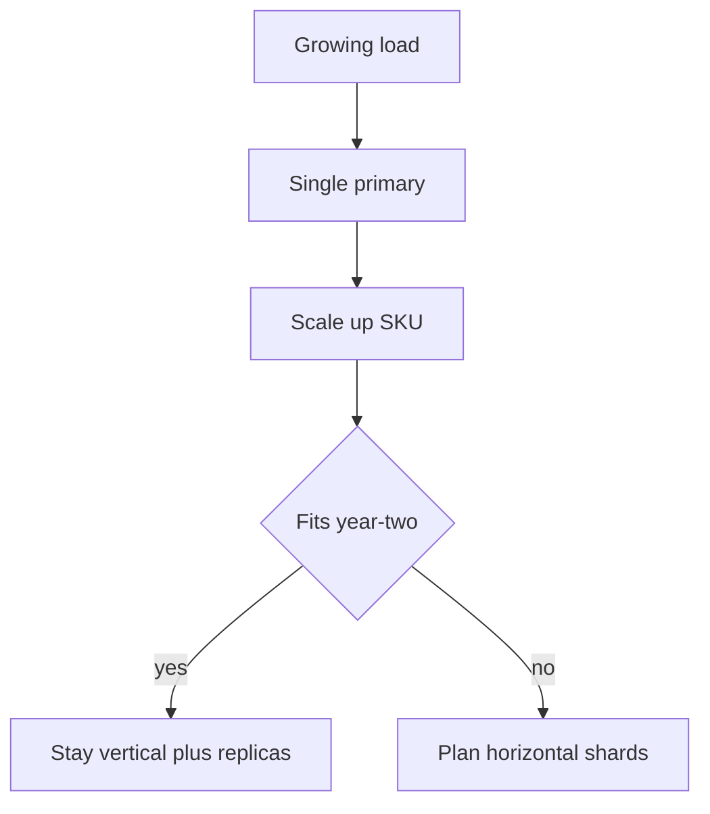

import { ConceptTemplate } from '@/features/kb/components/templates/ConceptTemplate'
import { Callout } from '@/features/kb/components/mdx/Callout'
import { ComparisonTable } from '@/features/kb/components/mdx/ComparisonTable'

export default function Layout({ children }) {
  return (
    <ConceptTemplate title="Vertical Scaling">
      {children}
    </ConceptTemplate>
  )
}

**Vertical scaling** (scale up) buys a larger machine: more cores, more RAM, faster NVMe, a bigger DB instance class. It is the first move when the software is single-primary or poorly parallel. It is also a dead end: there is a largest SKU, and that SKU is a single failure domain.

## 1. Deep Dive and Mechanics

Databases love vertical scale because one node means one set of locks, one planner, no distributed txn. Many products live for years on a large primary plus replicas for reads. That is a valid design.

**Diminishing returns.** Doubling cores does not double throughput if the workload is serialized on a WAL, a single writer thread, or a hot row. Memory helps working set; once the working set fits, more RAM is cache luxury.

**Ops.** Bigger boxes take longer to start, longer to snapshot, and hurt more when they die. Failover of a 4 TB primary is a different sport than failover of a 100 GB one.

<Callout icon="warning" title="The largest SKU is not a strategy">
If year-two data does not fit, you will shard under duress. Estimate data and write rate before you promise "we will just buy bigger."
</Callout>

## 2. Mathematical / Theoretical Foundation

Amdahl again: serial fraction s caps speedup on more cores. I/O latency does not fall just because the CPU is faster; you need a better device or fewer fsyncs (group commit).

Cost: cloud instance prices are often super-linear at the top end. Two medium nodes can be cheaper than one huge one — but only if the software can use both.

<ComparisonTable
  headers={['Move', 'Complexity', 'Ceiling', 'Blast radius']}
  rows={[
    ['Bigger instance', 'Low', 'SKU max', 'One node'],
    ['Faster disk', 'Low', 'Device max', 'One node'],
    ['Read replica', 'Medium', 'Write still primary', 'Primary writes'],
    ['Shard out', 'High', 'Fleet', 'Per shard'],
  ]}
/>

## 3. Real-World Implementation

```
# Intentional scale-up: raise the primary class, keep the same DNS name
# instance: db.r6i.2xlarge -> db.r6i.4xlarge
# then re-measure: WAL disk, lock waits, and hit rate. If WAL is the wall, cores will not save you.
```

Take a snapshot and a parameter snapshot before the resize. Some resizes reboot; treat it as a planned failover.

## 4. Visualizations



## 5. Interview Prep

**Q: Why start vertical?**
**A:** One node is easier to reason about, query, and back up. You postpone distributed bugs until the numbers force you.

**Q: When is vertical the wrong answer?**
**A:** Multi-region active-active, data larger than one disk, or write rates above one machine's WAL. Also when a single-box outage exceeds the SLO.

**Q: Can you mix both?**
**A:** Yes. Fat shards (vertical) times many shards (horizontal) is how large stores actually look.

## 6. Production Use Cases

- **Early-stage OLTP** on a managed large primary.
- **In-memory analytics** that need a terabyte-class box.
- **License-bound software** that cannot cluster.

<Callout icon="tip" title="Measure the serial resource">
If the wait is Lock or WALWrite, a larger CPU class is a more expensive wait. Fix the query or the write pattern first.
</Callout>
