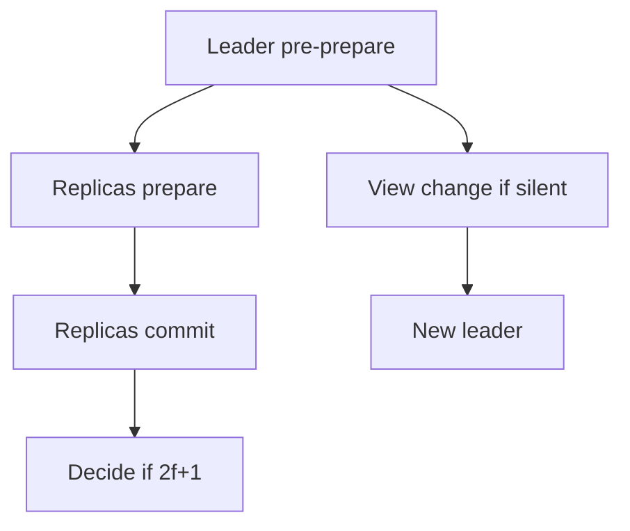

import { ConceptTemplate } from '@/features/kb/components/templates/ConceptTemplate'
import { Callout } from '@/features/kb/components/mdx/Callout'
import { ComparisonTable } from '@/features/kb/components/mdx/ComparisonTable'

export default function Layout({ children }) {
  return (
    <ConceptTemplate title="Byzantine Fault Tolerance">
      {children}
    </ConceptTemplate>
  )
}

**Byzantine fault tolerance (BFT)** is agreement when some nodes misbehave arbitrarily: crash, equivocate, or send different votes to different peers. The name comes from the Byzantine Generals problem. Crash-fault protocols (Raft) assume a node is either correct or silent. BFT assumes a node may be an adversary.

## 1. Deep Dive and Mechanics

A correct BFT protocol guarantees **safety** (honest nodes never decide different values) if fewer than one third of nodes are Byzantine, and **liveness** under partial synchrony (timeouts eventually work). Classic PBFT uses three phases: pre-prepare, prepare, commit, plus view changes when the leader is suspected.

**Quorums.** With n = 3f + 1, any two quorums of 2f + 1 intersect in at least one honest node. That intersection is why two decisions cannot diverge.

**Cost.** Extra rounds, signatures or MACs, and O(n^2) all-to-all chatter in naive PBFT. Modern chains batch, rotate leaders, and use threshold signatures to shrink messages.

<Callout icon="info" title="Most business systems are not Byzantine">
Your own data center replicas fail by crash and bad deploys, not by secretly forking the log. Use Raft unless the participants do not trust each other.
</Callout>

## 2. Mathematical / Theoretical Foundation

Lamport, Shostak, and Pease showed that with unauthenticated messages you need more than 3f nodes to tolerate f traitors. With signatures, the bound can relax in some models, but practical state-machine BFT still uses n = 3f + 1 for the usual partial-synchrony setting.

FLP still applies: you cannot guarantee progress in a fully asynchronous network. BFT protocols add timers and view changes.

<ComparisonTable
  headers={['Model', 'Bad node does', 'Typical quorum', 'Example']}
  rows={[
    ['Crash-stop', 'Silent', 'Majority n=2f+1', 'Raft, Paxos'],
    ['Byzantine', 'Anything', '2f+1 of 3f+1', 'PBFT, Tendermint'],
    ['Authenticated crash', 'Silent or lost', 'Varies', 'Some WAN Paxos'],
  ]}
/>

## 3. Real-World Implementation

```python
# Conceptual: accept a value only after 2f+1 matching prepares
def can_commit(prepares, n, f):
    need = 2 * f + 1
    if n < 3 * f + 1:
        return False
    return len(prepares) >= need
```

Real implementations add view-change logs, signed messages, and replay protection. Do not invent a BFT coin in an application repo.

## 4. Visualizations



## 5. Interview Prep

**Q: Why 3f + 1, not 2f + 1?**
**A:** A Byzantine node can vote both ways. Majority-of-crash math is not enough. You need enough honest overlap after subtracting f liars.

**Q: Is Bitcoin BFT?**
**A:** Nakamoto consensus is a probabilistic, incentive-based protocol with a different model (eventual common prefix, energy or stake). It is not PBFT. Do not equate "blockchain" with "BFT quorum."

**Q: When do you need BFT in a company?**
**A:** Multi-party settlement, consortium ledgers, or components that must survive a compromised replica that still has keys. Internal microservice A talking to B does not need BFT.

## 6. Production Use Cases

- **Permissioned ledgers** (Fabric, Tendermint-based chains) among institutions.
- **Certificate and timestamp authorities** that vote on inclusion.
- **Hostile-WAN control planes** where a vendor node is not fully trusted.

<Callout icon="tip" title="Measure f you can actually run">
n = 4 tolerates one liar and is already chatty. n = 22 is a research ops problem. Size from trust boundaries, not from hype.
</Callout>
