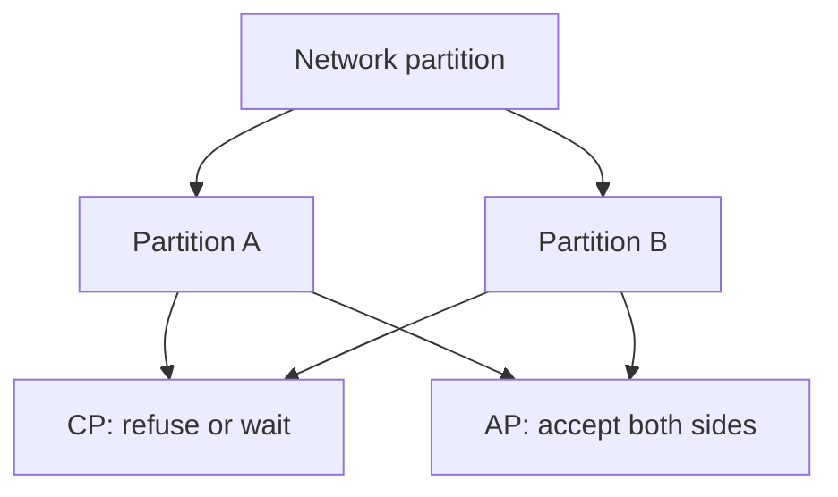

import { ConceptTemplate } from '@/features/kb/components/templates/ConceptTemplate'
import { Callout } from '@/features/kb/components/mdx/Callout'
import { ComparisonTable } from '@/features/kb/components/mdx/ComparisonTable'

export default function Layout({ children }) {
  return (
    <ConceptTemplate title="CAP Theorem">
      {children}
    </ConceptTemplate>
  )
}

The **CAP theorem** (Brewer; proved by Gilbert and Lynch) says that a linearizable distributed object cannot also stay available if the network partitions. You do not pick two of three like a menu. Partitions happen. When they do, you either refuse some operations (keep consistency) or serve possibly stale or split state (keep availability).

## 1. Deep Dive and Mechanics

**C** here means linearizability: a read sees the latest committed write as if there were one copy. **A** means every request to a non-crashed node returns a response. **P** means the protocol still meets its C or A claim when messages between nodes are dropped.

**CA is not a real WAN product.** If you assume no partitions, you assumed a single reliable network. That is a rack, not a planet. Production systems are CP or AP during a partition, and they still make latency-versus-consistency choices when the network is healthy (see PACELC).

**Examples.** ZooKeeper and etcd refuse writes without a majority (CP). Dynamo-style stores accept writes on both sides and repair later (AP). Many databases let you pick per call (quorum R + W, tunable).

<Callout icon="warning" title="CAP is about a partition, not about your SLA">
A CP system can be highly available in the no-partition case. CAP does not say CP is always down. It says what you sacrifice when the cable is cut.
</Callout>

## 2. Mathematical / Theoretical Foundation

Gilbert and Lynch formalize C as atomic objects and A as termination on every request to a correct node. In an asynchronous partitioned run, a write on one side cannot be visible to a read on the other without communication. If both must return, C is lost. If you wait, A is lost.

PACELC (Abadi) adds: else, when not partitioned, you still choose latency versus consistency (sync replication versus async).

<ComparisonTable
  headers={['During partition', 'Writes', 'Reads', 'Examples']}
  rows={[
    ['CP', 'Need quorum; may fail', 'May fail or stale-forbid', 'etcd, ZooKeeper, Raft DBs'],
    ['AP', 'Accept locally', 'May be stale or conflicting', 'Dynamo, Cassandra hinted'],
    ['CA (no P)', 'Single network assumed', 'Single copy feel', 'Single-node DB'],
  ]}
/>

## 3. Real-World Implementation

```python
# Tunable quorum: W + R > N is a common CP-leaning read
def is_strong_quorum(n, r, w):
    return r + w > n
```

If N=3, R=2, W=2, a partition that isolates one node still lets the majority proceed. A partition that splits 1 and 1 with one down loses writes. That is the CAP choice in numbers.

## 4. Visualizations



## 5. Interview Prep

**Q: Can we have all three?**
**A:** Not for linearizability and availability during a partition. You can have eventual consistency and high availability. You can have linearizability when a majority is reachable. You cannot have both guarantees on both sides of a cut.

**Q: Is MongoDB CP or AP?**
**A:** It depends on write concern, read concern, and whether a primary is elected. Answer with the settings, not a logo.

**Q: How is this different from ACID C?**
**A:** ACID consistency is about constraints on a transaction. CAP C is linearizability of a replicated register. Different letters, different theorems.

## 6. Production Use Cases

- **Config and locks** (CP): wrong answers are worse than a brief refusal.
- **Shopping carts** (often AP): take the add-to-cart, merge later.
- **Multi-region databases** with explicit failover and RPO, which is CAP plus ops.

<Callout icon="tip" title="Say what you refuse">
"We are CP" means "writes fail if we lose quorum." Write that in the runbook so on-call does not "fix" it by forcing a minority primary.
</Callout>
