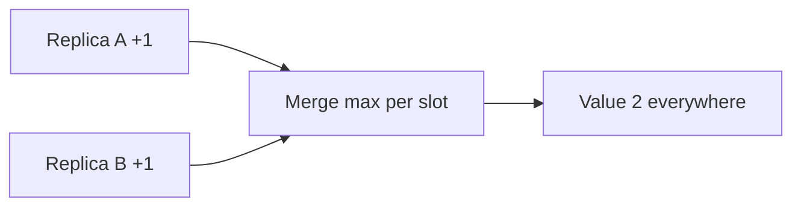

import { ConceptTemplate } from '@/features/kb/components/templates/ConceptTemplate'
import { Callout } from '@/features/kb/components/mdx/Callout'
import { ComparisonTable } from '@/features/kb/components/mdx/ComparisonTable'

export default function Layout({ children }) {
  return (
    <ConceptTemplate title="CRDTs">
      {children}
    </ConceptTemplate>
  )
}

**CRDTs** (conflict-free replicated data types) are structures whose concurrent updates always merge to the same result. Replicas can accept writes while partitioned. When they gossip state or operations, a join (or a commutative apply) converges. You give up arbitrary invariants (the last remaining seat) unless you encode them in the type.

## 1. Deep Dive and Mechanics

**State-based (CvRDT).** Each replica stores a payload that is a join-semilattice. Merge is least-upper-bound: max of clocks, union of sets, etc. Merge is associative, commutative, and idempotent — gossip can be sloppy.

**Op-based (CmRDT).** Replicas ship operations that must be delivered reliably and, for some types, without duplication. Ops commute by construction.

**Useful types.** G-Counter (grow-only). PN-Counter (plus and minus via two G-Counters). G-Set and 2P-Set. OR-Set (add-wins with unique tags). LWW-Register (timestamp, needs careful clocks). RGA / WOOT for text.

<Callout icon="warning" title="Convergence is not your business rule">
Two replicas can both sell the last item if the type is a counter. A CRDT converges to "sold twice." Inventory still needs reservations or a CP path.
</Callout>

## 2. Mathematical / Theoretical Foundation

A state CRDT is a join-semilattice: partial order and a least upper bound for every pair. Idempotent commutative monoids (Shapiro et al.) classify the op side. Causal delivery can be required for some op-based types; state-based merges are tolerant of reorder and replay.

Tombstones and unique ids are how deletes stay safe. Without them, a late add can resurrect a removed element (the classic set bug).

<ComparisonTable
  headers={['Type', 'Merge idea', 'Deletes', 'Fit']}
  rows={[
    ['G-Counter', 'Per-replica max then sum', 'No', 'Impressions'],
    ['OR-Set', 'Tagged adds, remove tags', 'Yes', 'Tags, ACLs'],
    ['LWW-Register', 'Highest timestamp wins', 'Overwrite', 'Profile fields'],
    ['RGA', 'Position ids', 'Tombstones', 'Collaborative text'],
  ]}
/>

## 3. Real-World Implementation

```python
# G-Counter: each replica only increments its own slot
class GCounter:
    def __init__(self, replica, slots=None):
        self.replica = replica
        self.slots = dict(slots or {})

    def inc(self):
        self.slots[self.replica] = self.slots.get(self.replica, 0) + 1

    def merge(self, other):
        keys = set(self.slots) | set(other.slots)
        self.slots = {k: max(self.slots.get(k, 0), other.slots.get(k, 0)) for k in keys}

    def value(self):
        return sum(self.slots.values())
```

In application code, use a library (Automerge, Yjs, Redis CRDTs) rather than a hand-rolled set.

## 4. Visualizations



## 5. Interview Prep

**Q: CRDT versus operational transform?**
**A:** OT transforms incoming ops against concurrent ops (Google Docs history). CRDTs converge by type laws and are easier to reason about offline. Both can edit text; the engineering cultures differ.

**Q: Do CRDTs need vector clocks?**
**A:** Many use dots or version vectors to identify ops. You need enough causal metadata to not drop a concurrent add. A wall clock LWW is a CRDT only if you accept clock-skew losers.

**Q: When not to use one?**
**A:** Unique inventory, money movement, or any invariant that is not preserved by the join. Also huge tombstone growth if you delete a lot.

## 6. Production Use Cases

- **Collaborative editors** (Yjs, Automerge) in the browser.
- **Edge counters and presence** in AP stores (Riak, Redis CRDT types).
- **Shopping-cart sets** that merge on reconnect, with a CP checkout at the end.

<Callout icon="tip" title="Pick the type from the invariant">
If add-wins is wrong, an OR-Set will make you sad. Write the conflict example on the whiteboard before you pick a library.
</Callout>
