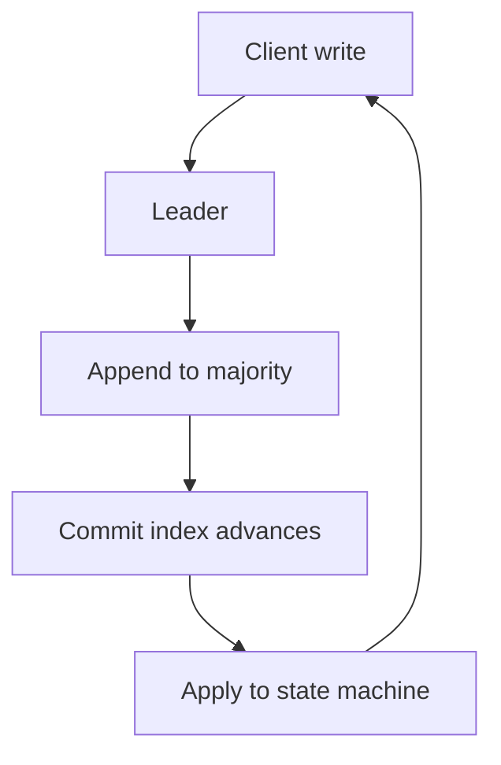

import { ConceptTemplate } from '@/features/kb/components/templates/ConceptTemplate'
import { Callout } from '@/features/kb/components/mdx/Callout'
import { ComparisonTable } from '@/features/kb/components/mdx/ComparisonTable'

export default function Layout({ children }) {
  return (
    <ConceptTemplate title="Consensus Algorithms">
      {children}
    </ConceptTemplate>
  )
}

**Consensus** is the problem of getting processes to decide the same value, with at most one decision, and with a valid value proposed by someone. Replicated state machines implement consensus on a **log**: first agree the next entry, then apply it. Paxos, Raft, Zab, and Viewstamped Replication are the industrial family for crash faults.

## 1. Deep Dive and Mechanics

A round has proposals, votes, and a commit rule that uses a **majority**. Because any two majorities intersect, two different values cannot both commit. Leaders (Raft) or ballots (Paxos) serialize proposals so the common case is one round-trip from the leader to a majority.

**Logs.** Agreement is not one register; it is a sequence. Snapshots truncate the prefix. Membership changes are themselves log entries (joint consensus in Raft) so the set of voters does not split-brain.

**What consensus is not.** Gossip. Primary-backup without quorum. A load balancer. Those can look "agreed" until a partition.

<Callout icon="info" title="Majority is a liveness tax">
If you need 2 of 3, one node can be down. If two are down, you cannot commit. You bought safety with that refusal.
</Callout>

## 2. Mathematical / Theoretical Foundation

Safety: agreement and validity. Liveness: eventually decide, under partial synchrony and a bound on faults f with n >= 2f + 1 for crash-stop. FLP: no deterministic algorithm guarantees termination in a fully async model with one crash. Timeouts are not a hack; they are the model.

Paxos is a single-decree core plus Multi-Paxos for a log. Raft specifies leader election, log repair, and snapshotting as one comprehensible package.

<ComparisonTable
  headers={['Protocol', 'Faults', 'Leader', 'Where you meet it']}
  rows={[
    ['Multi-Paxos', 'Crash', 'Stable proposer', 'Chubby, Spanner lineage'],
    ['Raft', 'Crash', 'Strong leader', 'etcd, Consul, Cockroach'],
    ['Zab', 'Crash', 'Primary', 'ZooKeeper'],
    ['PBFT', 'Byzantine', 'Primary + views', 'Permissioned chains'],
  ]}
/>

## 3. Real-World Implementation

```python
def majority(n):
    return n // 2 + 1

def can_commit(acks, n):
    return len(acks) >= majority(n)
```

Production code is the log, the term checks, and the disk. Use etcd or the Raft library in your database; do not ship a weekend consensus for money.

## 4. Visualizations



## 5. Interview Prep

**Q: Consensus versus replication?**
**A:** Replication copies bytes. Consensus decides a single order of those bytes under faults. Async replicas replicate without consensus and can diverge on failover.

**Q: Why is Raft more popular in new systems?**
**A:** Same safety goals as Multi-Paxos, with a more complete spec (elections, log repair, membership) that engineers can implement and test. Not because Paxos is wrong.

**Q: Can you consensus across regions?**
**A:** Yes, at the cost of a WAN RTT on the commit path. That is a product choice (Spanner-style) versus async DR.

## 6. Production Use Cases

- **Coordination services** (locks, config, leader keys).
- **Database commit logs** for linearizable SQL.
- **Service discovery** that must not flap on a split.

<Callout icon="tip" title="Test partition plus old leader">
The exam question is a paused leader that wakes. If your suite never does that, you have a happy-path log, not consensus.
</Callout>
