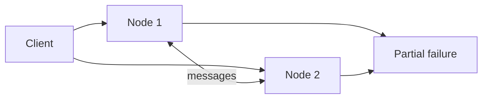

import { ConceptTemplate } from '@/features/kb/components/templates/ConceptTemplate'
import { Callout } from '@/features/kb/components/mdx/Callout'
import { ComparisonTable } from '@/features/kb/components/mdx/ComparisonTable'

export default function Layout({ children }) {
  return (
    <ConceptTemplate title="Distributed Computing">
      {children}
    </ConceptTemplate>
  )
}

**Distributed computing** is work split across machines that communicate by messages. There is no shared RAM, no common clock, and no atomic view of "the system." The fallacies of distributed computing (reliable network, zero latency, one admin) are still how outages start.

## 1. Deep Dive and Mechanics

You distribute to get **capacity**, **locality**, or **isolation**. The tax is partial failure: one node, one link, or one disk fails while the rest keep going. Callers must timeout. State must be replicated or accepted lost. Clocks cannot order events by themselves (see Lamport and true time).

**Models.** Synchronous (known delay bounds — rare). Asynchronous (no bounds — FLP bites). Partial synchrony (bounds eventually hold — what Raft assumes). Shared-memory versus message-passing; real networks are message-passing with a lot of caching on top.

**Layers.** HPC (MPI, tight clusters), data processing (MapReduce, Spark), and service-oriented request/response are all distributed computing with different failure and latency budgets.

<Callout icon="info" title="A remote call is not a function call">
It can return once, twice, or never, and the callee may have done the work. Idempotency and timeouts are part of the type signature.
</Callout>

## 2. Mathematical / Theoretical Foundation

Complexity is often counted in rounds and bits, not RAM. Lower bounds (set agreement, FLP, CAP) tell you what you cannot have. Happens-before (Lamport) is the causal order you actually get from messages.

Amdahl and USL still apply: serial work and coherency traffic cap speedup. Distribution that adds more chatter than parallelism makes programs slower.

<ComparisonTable
  headers={['Style', 'Coupling', 'Failure unit', 'Example']}
  rows={[
    ['Shared-memory threads', 'Tight', 'Process', 'One VM'],
    ['RPC microservices', 'Request', 'Service / instance', 'HTTP, gRPC'],
    ['Dataflow / batch', 'Dataset', 'Task / executor', 'Spark, MapReduce'],
    ['Actor / message', 'Mailbox', 'Actor', 'Erlang, Akka'],
  ]}
/>

## 3. Real-World Implementation

```python
# Partial failure: never wait forever
import socket

def rpc_call(host, payload, timeout_s=0.2):
    sock = socket.create_connection((host, 443), timeout=timeout_s)
    sock.settimeout(timeout_s)
    sock.sendall(payload)
    return sock.recv(4096)
```

Wrap with retries only when idempotent. Treat "no response" as unknown, not as "callee did nothing."

## 4. Visualizations



## 5. Interview Prep

**Q: Why not one bigger computer?**
**A:** Fault isolation, data gravity, and a ceiling on one box. Distribution is not a fashion; it is what remains after vertical scale and a single failure domain fail the SLO.

**Q: What is the first principle?**
**A:** Assume messages drop, reorder, and delay, and that the other side may have crashed after doing the work. Design APIs for that world.

**Q: Shared-nothing versus shared-disk?**
**A:** Shared-nothing partitions state and scales out. Shared-disk (or a SAN) centralizes consistency and the failure domain. Cloud object stores are a modern shared disk with different SLOs.

## 6. Production Use Cases

- **Internet services** split by stateless compute and sharded data.
- **Analytics clusters** that ship compute to data.
- **Edge plus cloud** splits for latency and sovereignty.

<Callout icon="tip" title="Name the failure you ignore">
Every design ignores some faults (Byzantine, solar flare). Write them down so a later team does not assume you handled them.
</Callout>
