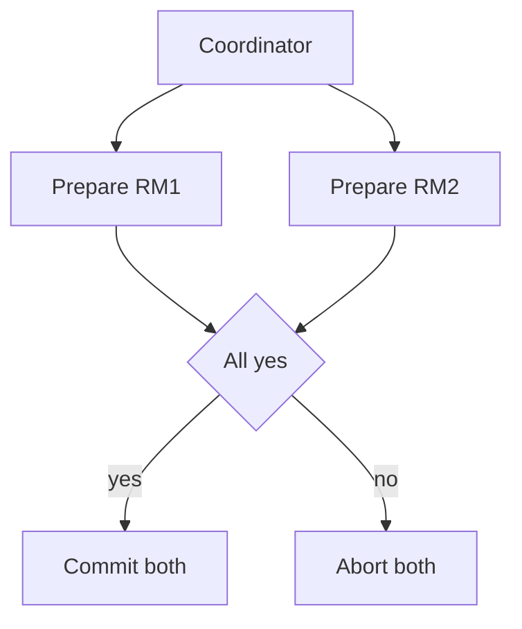

import { ConceptTemplate } from '@/features/kb/components/templates/ConceptTemplate'
import { Callout } from '@/features/kb/components/mdx/Callout'
import { ComparisonTable } from '@/features/kb/components/mdx/ComparisonTable'

export default function Layout({ children }) {
  return (
    <ConceptTemplate title="Distributed Transactions">
      {children}
    </ConceptTemplate>
  )
}

A **distributed transaction** makes several resource managers commit or abort together. The user wants "card charged and order created, or neither." Across processes, that is a protocol, not a BEGIN on one Postgres. The protocol you pick decides who blocks, what you lose on crash, and how long locks live.

## 1. Deep Dive and Mechanics

**Two-phase commit.** A coordinator asks participants to prepare (vote yes and persist). If all yes, it commits; else abort. Participants that voted yes must wait for the decision — they are **uncertain** if the coordinator dies after prepare. Recovery requires the coordinator log or a human.

**Three-phase commit** adds a pre-commit to reduce some blocking in a synchronous model; it is uncommon in the wild and still unhappy under partitions.

**Sagas.** A sequence of local transactions with compensations (undo). No global lock. You get eventual consistency and must make compensations real (refund, not "delete the charge if we remember").

**Percolator / MVCC + locks** and Spanner-style TrueTime are how some global SQL layers implement serializable distributed txn without a naive 2PC on the hot path.

<Callout icon="warning" title="2PC holds locks while the network thinks">
A slow or dead coordinator extends row locks across services. That is how a payment outage becomes a warehouse outage.
</Callout>

## 2. Mathematical / Theoretical Foundation

Atomic commit is consensus-adjacent: all honest participants decide the same commit/abort. Blocking 2PC is not partition-tolerant in the CAP sense: a participant cannot safely decide alone after a yes vote.

Sagas trade atomicity for isolation. Intermediate states are visible. Isolation anomalies are a product concern.

<ComparisonTable
  headers={['Approach', 'Atomic', 'Isolation', 'Failure mode']}
  rows={[
    ['Local ACID', 'Yes one store', 'Strong', 'One node'],
    ['2PC', 'Yes', 'Locks across', 'Coordinator block'],
    ['Saga', 'Eventual', 'Weak / app', 'Compensations'],
    ['Global SQL (Spanner)', 'Yes', 'Serializable*', 'WAN latency'],
  ]}
/>

## 3. Real-World Implementation

```python
def saga_place_order(order, pay, reserve):
    oid = order.create()
    try:
        pay.charge(oid)
        reserve.stock(oid)
    except Exception:
        pay.refund(oid)
        order.mark_failed(oid)
        raise
```

charge and refund must be idempotent. stock should fail if inventory is gone; do not compensate by pretending you never charged if refund can fail.

## 4. Visualizations



## 5. Interview Prep

**Q: Why not 2PC everywhere?**
**A:** Latency, lock time, and a coordinator as a single point of blocking. Fine inside one data-center DB cluster; painful as a web of microservices.

**Q: Are sagas transactions?**
**A:** They are a workflow with undo. They do not give ACID isolation. Say that clearly.

**Q: Outbox pattern?**
**A:** Write the business row and an event in one local transaction, then publish. That is how you avoid 2PC between DB and broker. Downstream still needs idempotency.

## 6. Production Use Cases

- **XA 2PC** between a DB and a legacy JMS broker inside one app server.
- **Order sagas** across payment, inventory, and shipping services.
- **Spanner / Cockroach** multi-shard SQL for products that need global serializability and can pay the RTT.

<Callout icon="tip" title="Keep the happy path on one shard">
If the shard key puts order and payment line on one node, you may not need a distributed txn at all.
</Callout>
