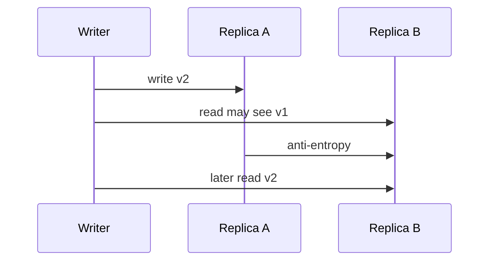

import { ConceptTemplate } from '@/features/kb/components/templates/ConceptTemplate'
import { Callout } from '@/features/kb/components/mdx/Callout'
import { ComparisonTable } from '@/features/kb/components/mdx/ComparisonTable'

export default function Layout({ children }) {
  return (
    <ConceptTemplate title="Eventual Consistency">
      {children}
    </ConceptTemplate>
  )
}

**Eventual consistency** says that if no new writes arrive, all replicas eventually agree. It does not say when. It does not say a read after a write on another socket will see that write. It is a convergence property, popular in AP stores, DNS, and caches. Treat "eventual" as incomplete until you add a bound or a session model.

## 1. Deep Dive and Mechanics

Replicas apply writes in different orders or at different times. Anti-entropy (repair, gossip, Merkle trees) and read repair close the gaps. Conflicts use LWW, vector clocks, CRDTs, or application merge.

**Session guarantees** (Terry et al.) make eventual usable: read-your-writes, monotonic reads, monotonic writes, writes-follow-reads. You get them with sticky routing, version tokens, or causal metadata — not from the word "eventual" alone.

**How stale.** Measure replication lag and repair age. If you cannot graph it, you cannot sell it as an SLO.

<Callout icon="warning" title="Eventual plus a user refresh loop is a bug">
A client that writes and immediately reads another replica will flap or retry forever. Pin the session or wait for a version.
</Callout>

## 2. Mathematical / Theoretical Foundation

Convergence requires that concurrent updates are somehow joinable (CRDT, LWW, or human). Without a join, "eventual" can be "eventual split brain."

CAP: eventual is the usual AP story during partition. PACELC: even without partition you may choose stale reads for latency (async replicas).

<ComparisonTable
  headers={['Guarantee', 'Stale read', 'Extra machinery']}
  rows={[
    ['Eventual only', 'Yes, unbounded', 'Repair'],
    ['Bounded staleness', 'Up to T or versions', 'Sync or watermarks'],
    ['Read-your-writes', 'Not for that client', 'Sticky or token'],
    ['Linearizable', 'No', 'Quorum / lease'],
  ]}
/>

## 3. Real-World Implementation

```python
def read_profile(replicas, user_id, seen_ver=0):
    row = replicas.any().get(user_id)
    if row.ver < seen_ver:
        row = replicas.primary().get(user_id)
    return row
```

Store seen_ver in the session. This is not linearizability across devices; it is read-your-writes for one client.

## 4. Visualizations



## 5. Interview Prep

**Q: Is eventual consistency bad?**
**A:** It is wrong for ledgers and right for view counts, DNS, and many caches. The mistake is using it silently on a workflow that the user thinks is strong.

**Q: How does Dynamo resolve conflicts?**
**A:** Vector clocks detect concurrent versions; the application or LWW merges. Sibling values are a feature until they surprise a product manager.

**Q: Eventual versus causal?**
**A:** Causal does not show you a reply before the message it replies to. Eventual might, briefly. Causal is stronger and costs metadata.

## 6. Production Use Cases

- **CDN and DNS** records with TTL-bound staleness.
- **Social counters and feeds** with repair.
- **Multi-region caches** that accept a few seconds of lag.

<Callout icon="tip" title="Put a number on eventual">
"Typically under 2 s, 99th under 30 s, repair job hourly" is a design. The adjective alone is not.
</Callout>
