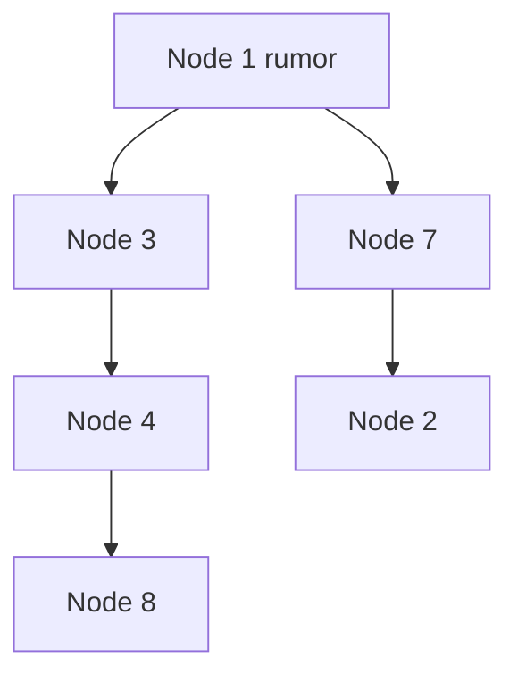

import { ConceptTemplate } from '@/features/kb/components/templates/ConceptTemplate'
import { Callout } from '@/features/kb/components/mdx/Callout'
import { ComparisonTable } from '@/features/kb/components/mdx/ComparisonTable'

export default function Layout({ children }) {
  return (
    <ConceptTemplate title="Gossip Protocols">
      {children}
    </ConceptTemplate>
  )
}

**Gossip** (epidemic protocol) spreads information the way a rumor does: each node periodically talks to a random peer and they merge what they know. There is no leader and no full mesh of constant heartbeats. Membership, failure detection, and anti-entropy in Dynamo-style stores all lean on gossip.

## 1. Deep Dive and Mechanics

**Push, pull, and push-pull.** Push sends what I know. Pull asks for what you know. Push-pull converges faster and is common. Payloads are digests (hashes, Merkle roots, version vectors) so you do not ship the whole database every round.

**Membership.** SWIM-style gossip carries membership plus a suspicion mechanism: ping, ping-req via a third party, then declare dead. That reduces false death versus a single missed heartbeat.

**Load.** Each node sends O(1) or O(log n) messages per period. Infection time is logarithmic in cluster size with high probability under uniform peer choice.

<Callout icon="info" title="Gossip is eventual">
A just-joined node is unknown until rumor reaches you. Design so a slightly stale membership map is safe (or wait for a stronger source of truth).
</Callout>

## 2. Mathematical / Theoretical Foundation

Epidemic models: if each infected node contacts a random peer, the fraction infected follows a logistic-like curve; time to infect all is O(log n) rounds with high probability. Bandwidth per node stays flat if message size is bounded (hence digests and compaction).

False-positive failure detection is a trade of timeout versus detection speed. Overlay bias (only gossip to nearby racks) can partition the rumor unless you add a few long-distance links.

<ComparisonTable
  headers={['Style', 'Messages per node', 'Convergence', 'Use']}
  rows={[
    ['Full mesh heartbeat', 'O(n)', 'Fast, expensive', 'Tiny clusters'],
    ['Gossip membership', 'O(1) to O(log n)', 'O(log n) rounds', 'Cassandra, Consul'],
    ['Central registry', 'O(1) to registry', 'Registry RTT', 'Classic SD'],
    ['Merkle anti-entropy', 'O(log keys) on diff', 'Repair-driven', 'Riak, Cassandra'],
  ]}
/>

## 3. Real-World Implementation

```python
import random

def gossip_round(self, peers):
    other = random.choice(peers)
    mine = self.digest()
    theirs = other.exchange(mine)
    self.merge(theirs)
```

Bound digest size. If merge is not idempotent and commutative, gossip will not converge; you have a heisenbug cluster.

## 4. Visualizations



## 5. Interview Prep

**Q: Gossip versus Raft for membership?**
**A:** Raft is strong and limited in size. Gossip scales membership and accepts brief disagreement. Many systems gossip for liveliness and use Raft for a small config that must be true.

**Q: Why random peers, not a tree?**
**A:** Trees have bottlenecks and break on failure. Random (or random plus a few structured edges) is robust. Trees appear inside a single repair, not as the only path.

**Q: Can gossip replace a load balancer health check?**
**A:** It can feed a suspicion list. Clients still need a rule for "too new" and "recently dead" to avoid flapping.

## 6. Production Use Cases

- **Cassandra / Riak** membership and repair.
- **SWIM** in Nomad, Serf, and parts of Consul.
- **Telemetry fan-out** of non-critical state (feature seeds, peer lists).

<Callout icon="tip" title="Cap rumor size">
A gossip payload that grows with the whole dataset will melt the network. Gossip metadata; repair bulk data out of band.
</Callout>
