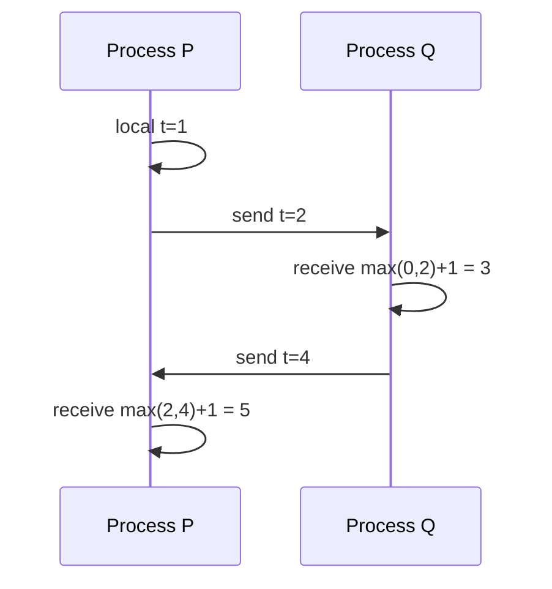

import { ConceptTemplate } from '@/features/kb/components/templates/ConceptTemplate'
import { Callout } from '@/features/kb/components/mdx/Callout'
import { ComparisonTable } from '@/features/kb/components/mdx/ComparisonTable'

export default function Layout({ children }) {
  return (
    <ConceptTemplate title="Lamport Clocks">
      {children}
    </ConceptTemplate>
  )
}

A **Lamport clock** is a counter each process keeps. You increment on every local event. When you send a message, you attach the counter. When you receive, you set clock = max(local, received) + 1. If event a happens-before event b, then C(a) is less than C(b). The converse is false: smaller counters do not prove causality.

## 1. Deep Dive and Mechanics

Happens-before (Lamport 1978) is the transitive closure of program order and message send/receive. Logical clocks track that relation without synchronized wall clocks.

**What they cannot do.** Concurrent events can get any two numbers; the smaller one is not "earlier in real time." Two writes with C=5 and C=7 might be concurrent if they never talked. Last-write-wins on a Lamport clock will invent an order and can drop a concurrent write silently.

**Vector clocks** add one slot per process so you can detect concurrency (incomparable vectors) instead of forcing a total order.

<Callout icon="info" title="Wall clocks lie in a different way">
NTP skew of tens of milliseconds is enough to reorder two writes. Lamport clocks refuse to use those timestamps for causality. They still do not give you real-time linearizability.
</Callout>

## 2. Mathematical / Theoretical Foundation

Clock condition: a -> b implies C(a) < C(b). This is a homomorphism from the happens-before poset into the integers. It is not an isomorphism: many incomparable pairs get comparable integers.

Total-order broadcast can be built by ordering (timestamp, process-id) pairs and delaying delivery until no earlier stamp can arrive — that needs extra buffering and is not free.

<ComparisonTable
  headers={['Clock', 'Detects causality', 'Detects concurrent', 'Cost']}
  rows={[
    ['Wall / NTP', 'No', 'No', 'Skew'],
    ['Lamport scalar', 'One way', 'No', 'One integer'],
    ['Vector clock', 'Yes', 'Yes', 'O(n) metadata'],
    ['TrueTime / Hybrid', 'Approx real time', 'Bounded', 'Special infra'],
  ]}
/>

## 3. Real-World Implementation

```python
class Lamport:
    def __init__(self):
        self.t = 0

    def on_local(self):
        self.t += 1
        return self.t

    def send(self):
        self.t += 1
        return self.t

    def receive(self, other_t):
        self.t = max(self.t, other_t) + 1
        return self.t
```

Attach t to every message. Do not sort user-visible history by t alone if concurrent edits must both appear.

## 4. Visualizations



## 5. Interview Prep

**Q: If C(a) is less than C(b), did a happen before b?**
**A:** Not necessarily. Only the converse is guaranteed. This is the most common trap.

**Q: Why not just use timestamps?**
**A:** Without a bound on skew (TrueTime), a later real-time event can carry an earlier wall clock. Lamport at least never reverses a message chain.

**Q: When do you upgrade to vectors?**
**A:** When you must detect concurrent updates (siblings in a store) instead of picking a winner. Metadata grows with the number of writers unless you compact.

## 6. Production Use Cases

- **Debug traces** that order logs along causal chains.
- **Lightweight version tags** when you only need a total order and accept arbitrary concurrent ties.
- **Teaching and interviews** as the base before vector clocks and CRDTs.

<Callout icon="tip" title="Name concurrent events in the design">
If two cashiers can update the same SKU without talking, a scalar clock will hide that. Draw the pair before you pick LWW.
</Callout>
