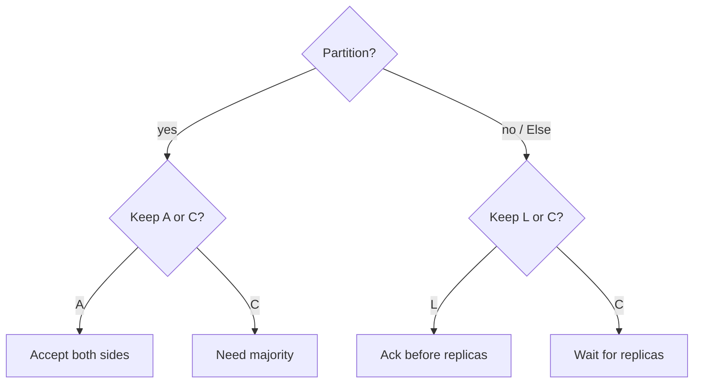

import { ConceptTemplate } from '@/features/kb/components/templates/ConceptTemplate'
import { Callout } from '@/features/kb/components/mdx/Callout'
import { ComparisonTable } from '@/features/kb/components/mdx/ComparisonTable'

export default function Layout({ children }) {
  return (
    <ConceptTemplate title="PACELC Theorem">
      {children}
    </ConceptTemplate>
  )
}

**PACELC** (Abadi) extends CAP. If there is a Partition, choose Availability or Consistency. Else, even when every replica can talk, choose Latency or Consistency. CAP only talks about the cut. Most of the day there is no cut, and you still pay for sync replication or you serve stale reads.

## 1. Deep Dive and Mechanics

**PA/EL.** During a partition, stay up and accept divergent writes. In the healthy case, acknowledge before all replicas catch up. Dynamo-style stores and default Cassandra sit here.

**PC/EC.** During a partition, refuse writes without a quorum. In the healthy case, wait for a sync majority before success. etcd, ZooKeeper, and Spanner-style systems sit here.

**Mixed knobs.** Many products are not one letter pair. DynamoDB lets you pick consistent reads. MongoDB can be PC/EC with majority write concern or PA/EL with w=1. The useful interview move is to name the default and the override.

<Callout icon="info" title="CAP is the outage; PACELC is the Tuesday">
A CP database can still be fast when the network is fine if it only waits for a nearby quorum. PACELC is about that wait, not about whether the product is down forever.
</Callout>

## 2. Mathematical / Theoretical Foundation

CAP: in an asynchronous partitioned run, a linearizable object cannot also terminate every request at every correct node. PACELC adds the no-partition case: the write's critical path either includes remote acknowledgments (consistency, higher latency) or does not (latency, weaker visibility).

Round-trip cost is the model. Sync replication latency is at least the RTT to the farthest replica you wait for. Async replication latency is local disk plus a later catch-up risk.

<ComparisonTable
  headers={['Class', 'If partitioned', 'Else (healthy)', 'Typical product']}
  rows={[
    ['PA/EL', 'Serve both sides', 'Async / local ack', 'Cassandra default, Dynamo'],
    ['PC/EC', 'Refuse minority writes', 'Sync quorum', 'etcd, Cockroach, Spanner'],
    ['PA/EC', 'Available, then sync later', 'Rare combo', 'Unusual; name it if you claim it'],
    ['PC/EL', 'Refuse, but async when up', 'Odd default', 'Usually a misconfig'],
  ]}
/>

## 3. Real-World Implementation

```python
def classify(partition_pref, healthy_pref):
    # partition_pref: "A" or "C"
    # healthy_pref: "L" or "C"
    return f"P{partition_pref}/E{healthy_pref}"

assert classify("A", "L") == "PA/EL"
assert classify("C", "C") == "PC/EC"
```

Map each API call: write concern, read concern, and whether the client retries on timeout. Timeouts are how PACELC shows up in SLOs.

## 4. Visualizations



## 5. Interview Prep

**Q: Does PACELC replace CAP?**
**A:** No. CAP is the partition impossibility. PACELC names the everyday latency-versus-consistency choice that CAP does not mention.

**Q: Is DynamoDB PA/EL?**
**A:** Default reads can be eventually consistent and writes ack after a small replica set. Strongly consistent reads move a call toward C at extra latency. Say "tunable," then name the default.

**Q: Can a CP system still choose L when healthy?**
**A:** If it only waits for a local majority and async-replicates elsewhere, healthy-path latency can stay low while partition behavior stays CP. That is PC/EL-ish; be precise per region.

## 6. Production Use Cases

- **Checkout and ledgers** usually want PC/EC on the money path.
- **Feed counters and presence** often accept PA/EL.
- **Multi-region SQL** products advertise the PACELC pair in the docs; read that page before you promise RPO zero.

<Callout icon="tip" title="Write the pair on the whiteboard">
Interviewers want PA/EL versus PC/EC, one product each, and one sentence on what the user sees when a replica is slow.
</Callout>
