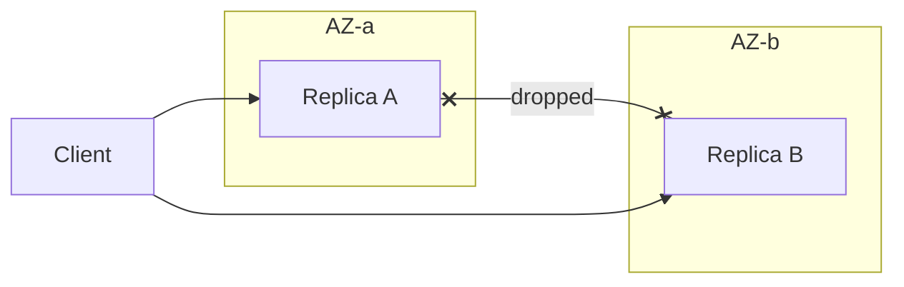

import { ConceptTemplate } from '@/features/kb/components/templates/ConceptTemplate'
import { Callout } from '@/features/kb/components/mdx/Callout'
import { ComparisonTable } from '@/features/kb/components/mdx/ComparisonTable'

export default function Layout({ children }) {
  return (
    <ConceptTemplate title="Partition Tolerance">
      {children}
    </ConceptTemplate>
  )
}

**Partition tolerance** means the protocol's guarantees still hold when the network drops or delays messages between nodes. CAP's P is not optional on a real WAN. You do not "choose not to be partition tolerant." You choose what to sacrifice when a partition happens.

## 1. Deep Dive and Mechanics

A **partition** is a cut in the communication graph: A cannot reach B for long enough that timeouts fire. Causes include switch failure, BGP, overloaded NICs, and GC pauses that look like silence.

**What P does not mean.** It does not mean "the app stays up." A CP system is partition tolerant and will refuse writes on the minority side. That is still P.

**False partitions.** Slow disks and stop-the-world GC make a node look dead. Fencing and leader leases exist so two leaders do not both accept writes during a false cut.

<Callout icon="warning" title="The network is not a light switch">
Most partitions are partial: some packets get through, some are delayed 2 seconds. Protocols that assume clean fail-stop will double-process or split-brain unless they use quorums and fencing.
</Callout>

## 2. Mathematical / Theoretical Foundation

In the asynchronous model there is no bound on message delay, so a crashed node and a slow node are indistinguishable. FLP says consensus cannot be both safe and always live in that model. Partial synchrony (GST after which delays are bounded) is how Raft and Paxos recover liveness.

A partition of duration T with sync replication of RTT r stalls the minority (or both sides) for about T. Async replication instead accumulates a lag of roughly the unsent log.

<ComparisonTable
  headers={['View', 'Meaning of P', 'What you drop']}
  rows={[
    ['CAP formal', 'Spec holds under message loss', 'C or A'],
    ['Ops slang', 'We keep serving', 'Often C, silently'],
    ['CP product', 'Minority refuses writes', 'Availability on that side'],
    ['AP product', 'Both sides accept', 'One-copy consistency'],
  ]}
/>

## 3. Real-World Implementation

```python
def side_can_write(have_quorum, prefer_consistency):
    if have_quorum:
        return True
    return not prefer_consistency
```

Health checks must use the same quorum the write path uses. A load balancer that marks a minority primary "healthy" will send traffic into a fence.

## 4. Visualizations



## 5. Interview Prep

**Q: Can I pick CA and skip P?**
**A:** Only if you assume the network never fails. That is a single rack with one switch, not a multi-AZ service. On a WAN, CA is a fiction.

**Q: Is a partition the same as a node crash?**
**A:** A crash is silence from one node. A partition can leave two live groups that cannot talk. Split-brain is the partition problem.

**Q: How do you detect a partition?**
**A:** You do not detect it perfectly. You use heartbeats, leases, and quorums, then fence the old leader. Detection is a timeout, not a proof.

## 6. Production Use Cases

- **Multi-AZ databases** that lose the inter-AZ link and must pick quorum or dual-write.
- **Mobile clients** that are partitioned from the API for hours and need CRDTs or queues.
- **Service meshes** that shed or fail closed when a dependency's region disappears.

<Callout icon="tip" title="Draw the cut first">
Before naming CAP letters, draw which clients can still reach which replicas. The letters follow the picture.
</Callout>
