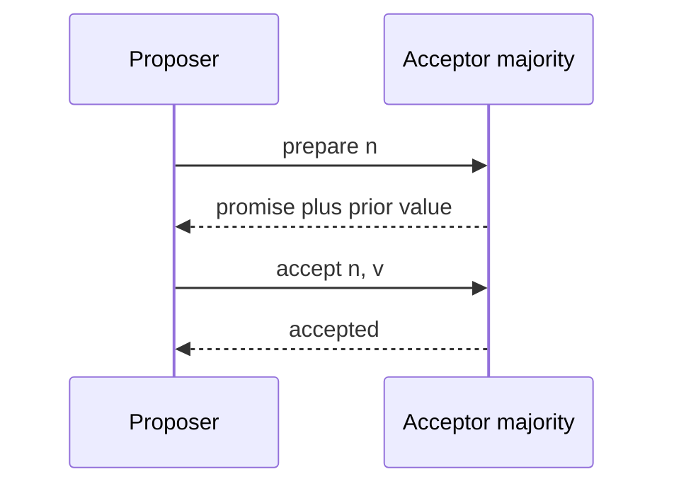

import { ConceptTemplate } from '@/features/kb/components/templates/ConceptTemplate'
import { Callout } from '@/features/kb/components/mdx/Callout'
import { ComparisonTable } from '@/features/kb/components/mdx/ComparisonTable'

export default function Layout({ children }) {
  return (
    <ConceptTemplate title="Paxos">
      {children}
    </ConceptTemplate>
  )
}

**Paxos** (Lamport) is the classic crash-fault consensus protocol. A value is chosen when a majority of acceptors accept it under the same ballot. Any two majorities intersect, so two different values cannot both be chosen. Multi-Paxos runs the same idea for a log of slots.

## 1. Deep Dive and Mechanics

**Roles.** Proposers try to get a value chosen. Acceptors remember the highest promise and the highest accepted proposal. Learners hear the outcome. One node can play every role.

**Phase 1 (prepare).** Proposer picks ballot n higher than any it has seen, asks acceptors to promise not to accept below n. Each reply includes any value already accepted.

**Phase 2 (accept).** If a majority promised, the proposer must propose the value from the highest-numbered prior accept (or its own value if none). Acceptors accept if they have not promised a higher ballot.

**Why it is hard.** Duelling proposers can livelock. Real systems elect a stable leader (Multi-Paxos) so phase 1 is rare. Chubby, Spanner's Paxos groups, and early Megastore are in this family.

<Callout icon="info" title="Paxos chooses a value; it does not store your table">
Consensus is one replicated log. Your SQL, lock, or config sits on top. Do not "run Paxos" on every user write without a log and a state machine.
</Callout>

## 2. Mathematical / Theoretical Foundation

Safety: if proposal (n, v) is chosen, every higher-numbered chosen proposal has value v. Proof is by majority intersection plus the rule that phase 2 must reuse the highest accepted value from phase 1.

Liveness: not guaranteed in a fully asynchronous network (FLP). With a single live leader and eventual timely messages, progress resumes.

<ComparisonTable
  headers={['Flavor', 'What it adds', 'Where you see it']}
  rows={[
    ['Single-decree', 'One value', 'Proofs, teaching'],
    ['Multi-Paxos', 'Stable leader, log slots', 'Chubby, Spanner groups'],
    ['Cheap Paxos', 'F+1 acceptors + extras', 'WAN cost cuts'],
    ['Raft', 'Same quorum idea, more ops-friendly', 'etcd, Consul'],
  ]}
/>

## 3. Real-World Implementation

```python
def can_accept(promise_n, accept_n, incoming_n):
    return incoming_n >= promise_n and incoming_n >= accept_n
```

Production code is about persistence: promise and accept records must hit stable storage before you reply, or a crash can accept two values.

## 4. Visualizations



## 5. Interview Prep

**Q: Why a majority?**
**A:** Any two majorities share a node. That node carries the previously chosen value into the next prepare, so the value cannot flip.

**Q: Paxos versus Raft?**
**A:** Same quorum intersection idea. Raft specifies leader election, log roles, and membership changes in one package. Paxos is a family; Multi-Paxos is the production form.

**Q: What is a ballot number?**
**A:** A totally ordered proposal id, usually (counter, proposer-id). Higher ballots preempt lower ones so a new leader can finish an incomplete round.

## 6. Production Use Cases

- **Google Chubby / Spanner** Paxos groups for locks and tablets.
- **Azure and AWS** internal control planes (variants).
- **Teaching the proof** before you operate Raft in prod.

<Callout icon="tip" title="Name Multi-Paxos in interviews">
Single-decree Paxos is the proof. The product is a leader driving a log. Say both.
</Callout>
