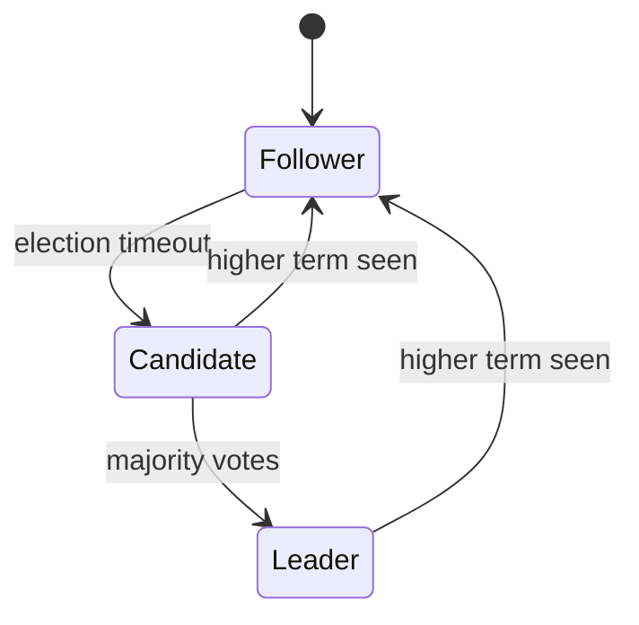

import { ConceptTemplate } from '@/features/kb/components/templates/ConceptTemplate'
import { Callout } from '@/features/kb/components/mdx/Callout'
import { ComparisonTable } from '@/features/kb/components/mdx/ComparisonTable'

export default function Layout({ children }) {
  return (
    <ConceptTemplate title="Raft">
      {children}
    </ConceptTemplate>
  )
}

**Raft** (Ongaro and Ousterhout) is crash-fault consensus with a strong leader. Clients talk to the leader. The leader appends to its log and commits an entry when a majority of voting members have stored it. Terms increase on each election so stale leaders cannot overwrite committed data.

## 1. Deep Dive and Mechanics

**States.** Follower, candidate, leader. Followers grant votes and accept appends. A follower that times out becomes a candidate and starts an election for term T+1.

**Election.** A candidate wins with a majority of votes. A node votes at most once per term, and only if the candidate's log is at least as up to date (higher last term, or same term and longer or equal index).

**Replication.** The leader sends AppendEntries with previous index and term. If they do not match, the follower rejects and the leader walks back. Commit index is the highest entry known to be on a majority in the current term.

**Membership.** Joint consensus (old and new configs) avoids a two-majority split during add/remove.

<Callout icon="warning" title="A lone leader is not committed">
An entry on the leader disk is not committed. If that leader dies before a majority stores it, the next leader may not have it. Clients must retry with idempotency.
</Callout>

## 2. Mathematical / Theoretical Foundation

Safety: at most one leader per term; committed entries in term t persist in all later leaders' logs (Leader Completeness). Election restriction plus majority votes give the proof.

Liveness: under partial synchrony and randomized timeouts, a leader is elected with high probability. Split votes resolve when timeouts differ.

<ComparisonTable
  headers={['Piece', 'Raft rule', 'Why']}
  rows={[
    ['Term', 'Monotonic epoch', 'Fence old leaders'],
    ['Majority', 'Votes and commits', 'Intersection'],
    ['Log match', 'Prev index plus term', 'No holes, no forks of committed prefix'],
    ['Up-to-date vote', 'Last term then length', 'New leader has all commits'],
  ]}
/>

## 3. Real-World Implementation

```python
def log_ok(cand_last_term, cand_last_idx, my_last_term, my_last_idx):
    if cand_last_term != my_last_term:
        return cand_last_term > my_last_term
    return cand_last_idx >= my_last_idx
```

etcd, Consul, CockroachDB ranges, and RethinkDB use Raft. Keep the voting set small (3 or 5). Learners can receive the log without voting.

## 4. Visualizations



## 5. Interview Prep

**Q: Why odd replica counts?**
**A:** 3 nodes tolerate 1 failure; 5 tolerate 2. Even counts waste a vote without extra fault budget. Quorum is still majority, so 4 nodes only tolerate 1.

**Q: Can two leaders exist?**
**A:** Briefly, a partitioned old leader may still think it is leader until its term is beaten. It cannot commit new entries without a majority. Clients that talk to it may time out.

**Q: Raft versus Multi-Paxos?**
**A:** Same intersection math. Raft fixes the leader, log, and reconfiguration story so implementations converge. Paxos papers leave more choices.

## 6. Production Use Cases

- **etcd / Kubernetes** control plane.
- **Consul** catalog and sessions.
- **Distributed SQL** range groups (Cockroach, TiKV).

<Callout icon="tip" title="Never hide the term in metrics">
If term is climbing, elections are looping. That is the first graph to page on.
</Callout>
