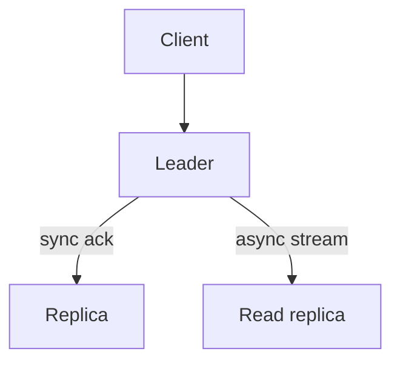

import { ConceptTemplate } from '@/features/kb/components/templates/ConceptTemplate'
import { Callout } from '@/features/kb/components/mdx/Callout'
import { ComparisonTable } from '@/features/kb/components/mdx/ComparisonTable'

export default function Layout({ children }) {
  return (
    <ConceptTemplate title="Replication Strategies">
      {children}
    </ConceptTemplate>
  )
}

**Replication** keeps copies of the same data on more than one node. The strategy is the pairing of topology (who accepts writes) and durability (when you tell the client OK). Topology without the ack rule is incomplete.

## 1. Deep Dive and Mechanics

**Single-leader (primary/secondary).** All writes go to one primary. Secondaries pull or receive a stream. Simple conflict story. Failover needs fencing so the old primary cannot keep writing.

**Multi-leader.** Several primaries accept writes, often one per region. Conflicts are resolved with LWW, versions, or CRDTs. Good for write-local latency; bad if you pretend there are no conflicts.

**Leaderless.** Clients write to a quorum (W) and read from a quorum (R). If R + W is greater than N, reads overlap a write. Sloppy quorums and hinted handoff keep availability during a partition.

**Sync versus async.** Sync waits for replicas (PACELC: C). Async returns after local persist (L) and risks RPO greater than zero.

<Callout icon="warning" title="Async replica is not a zero-RPO DR plan">
If the primary dies before the stream lands, those writes are gone. Call it a read scale replica, not disaster recovery, unless the business accepts the lag.
</Callout>

## 2. Mathematical / Theoretical Foundation

Quorum: R + W greater than N implies a read sees at least one node that saw the write (for a single key, ignoring concurrent writers and hinted handoff). Concurrent writes still need timestamps or vector clocks.

Sync replication commit latency is at least the RTT to the slowest replica in the wait set. Availability of a single-leader system is gated by primary health plus failover time.

<ComparisonTable
  headers={['Strategy', 'Write path', 'Conflicts', 'Typical use']}
  rows={[
    ['Single-leader sync', 'Primary plus replicas', 'None', 'Money, config'],
    ['Single-leader async', 'Primary then stream', 'None until failover', 'Read replicas'],
    ['Multi-leader', 'Local primary', 'Yes', 'Multi-region active-active'],
    ['Leaderless quorum', 'W of N', 'Yes', 'Dynamo, Cassandra'],
  ]}
/>

## 3. Real-World Implementation

```python
def quorum_read_fresh(n, r, w):
    return r + w > n
```

Postgres streaming, MySQL binlog, Kafka ISR, and Cassandra replication factor are all this table with different defaults.

## 4. Visualizations



## 5. Interview Prep

**Q: When do you pick multi-leader?**
**A:** When write latency must be regional and conflict rate is low or mergeable. Calendars and documents yes; unique inventory counts no unless you serialize.

**Q: What is chain replication?**
**A:** Writes flow down a chain; the tail serves reads. Strong sequential story, sensitive to tail failure.

**Q: Replica lag versus consistency?**
**A:** Lag is a time number. Consistency is a guarantee about what a read can see. You can have small lag and still serve a stale read if the router is wrong.

## 6. Production Use Cases

- **OLTP primary plus analytics replica** (async).
- **Multi-AZ sync** for RPO zero inside a region.
- **Dynamo-style** stores with tunable R and W.

<Callout icon="tip" title="State RPO and RTO with the topology">
Interviewers want seconds of data loss and minutes of failover, not just "we replicate."
</Callout>
