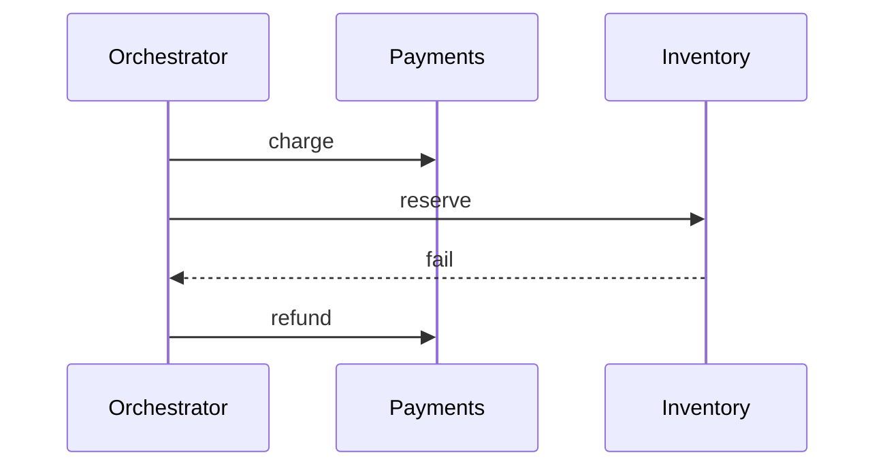

import { ConceptTemplate } from '@/features/kb/components/templates/ConceptTemplate'
import { Callout } from '@/features/kb/components/mdx/Callout'
import { ComparisonTable } from '@/features/kb/components/mdx/ComparisonTable'

export default function Layout({ children }) {
  return (
    <ConceptTemplate title="Saga Pattern">
      {children}
    </ConceptTemplate>
  )
}

A **saga** is a sequence of local transactions. Each step publishes or records that it succeeded. If a later step fails, earlier steps run **compensations** that semantically undo (refund, cancel, release). There is no single global lock and no two-phase commit across services.

## 1. Deep Dive and Mechanics

**Choreography.** Each service listens for the previous event and emits the next. Few moving parts, hard to see the whole graph, easy to cycle.

**Orchestration.** A coordinator (state machine, Temporal, Step Functions) tells each service what to do and records progress. Easier timeouts, retries, and human replay.

**Compensation is not rollback.** You cannot un-send an email. You send an apology. You cannot un-charge if the acquirer already settled; you refund. Design compensations as first-class APIs.

**Idempotency.** Every step and compensation must be safe to retry. Sagas retry.

<Callout icon="warning" title="A failed compensation is an incident">
If refund fails after ship fails, you have money and goods in an unknown state. Put compensations on a dead-letter path with paging, not a log line.
</Callout>

## 2. Mathematical / Theoretical Foundation

Sagas (Garcia-Molina and Salem) trade atomicity for isolation. The global history is not serializable: other readers can see a booking that later cancels. You get eventual semantic consistency if every forward step has a compensation that converges.

Name the isolation holes: dirty business state, lost uniqueness if two sagas book the last seat. Use reservations with TTLs to close the seat race.

<ComparisonTable
  headers={['Approach', 'Atomicity', 'Holds locks', 'Best for']}
  rows={[
    ['2PC', 'Yes', 'Yes, across nodes', 'One DB vendor, short'],
    ['Saga choreography', 'Semantic undo', 'No', 'Simple linear flows'],
    ['Saga orchestration', 'Semantic undo', 'No', 'Timeouts, humans, many steps'],
    ['Outbox plus queue', 'Per service', 'Local only', 'The usual glue'],
  ]}
/>

## 3. Real-World Implementation

```python
def run_saga(steps):
    done = []
    try:
        for step in steps:
            step.forward()
            done.append(step)
    except Exception:
        for step in reversed(done):
            step.compensate()
        raise
```

Persist the saga state before each call. In-memory "done" lists die with the process.

## 4. Visualizations



## 5. Interview Prep

**Q: Saga versus 2PC?**
**A:** 2PC keeps locks and blocks on a coordinator. Sagas finish local commits and repair with compensations. Use sagas across services; use 2PC inside one database product if you must.

**Q: What if compensation cannot exist?**
**A:** That step should be last, or you need a reservation that expires, or you should not split the transaction across systems.

**Q: How do you make it idempotent?**
**A:** Saga id plus step name as a unique key. Store outcome. Retries read the row instead of charging twice.

## 6. Production Use Cases

- **Order, pay, allocate, ship** in commerce.
- **Provision then bill** in cloud control planes.
- **Temporal / Cadence / Step Functions** as the orchestrator.

<Callout icon="tip" title="Write the unhappy path on the ticket">
If the design doc only has the happy sequence, it is not a saga design yet.
</Callout>
