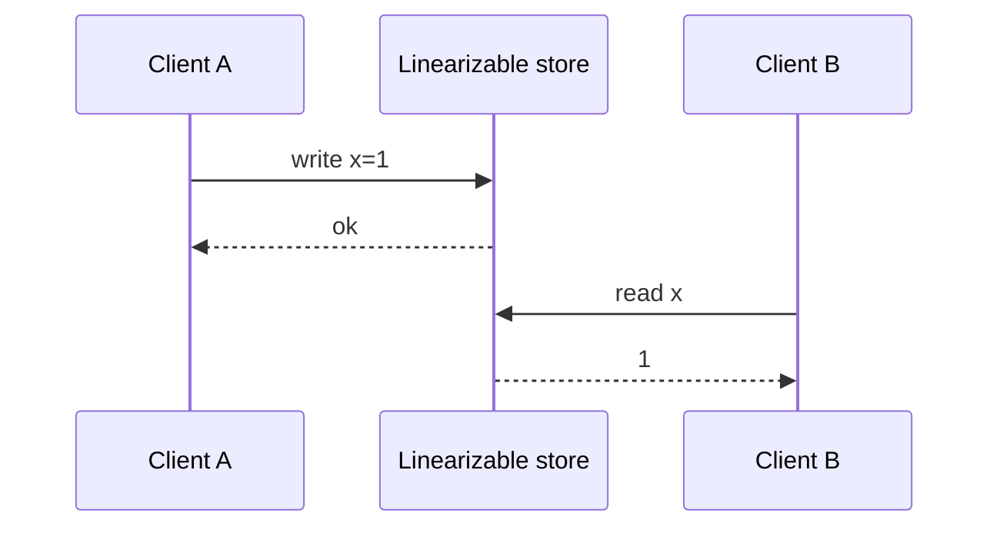

import { ConceptTemplate } from '@/features/kb/components/templates/ConceptTemplate'
import { Callout } from '@/features/kb/components/mdx/Callout'
import { ComparisonTable } from '@/features/kb/components/mdx/ComparisonTable'

export default function Layout({ children }) {
  return (
    <ConceptTemplate title="Strong Consistency">
      {children}
    </ConceptTemplate>
  )
}

**Strong consistency** in interviews usually means **linearizability**: a read returns the latest completed write, and the real-time order of non-overlapping operations is respected. Weaker "strong" slogans (read-your-writes, monotonic reads) are session guarantees, not one-copy linearizability.

## 1. Deep Dive and Mechanics

**Linearizability** (Herlihy and Wing) places each operation at a single point between invoke and response. Once a write returns, every later read in real time sees it (or a later write).

**Sequential consistency** (Lamport) preserves each process's order but may reorder concurrent clients relative to real time. CPUs often give this; geo-databases often do not.

**How stores implement it.** Single leader plus sync quorum; or consensus on every write (Raft, Paxos); or TrueTime-bounded commit waits (Spanner). Reads may go to the leader or to a replica that has applied the commit index.

<Callout icon="info" title="Majority write is not enough if reads skip the quorum">
W=majority and R=1 can miss the write. Strong reads need a quorum that intersects, or a lease that pins a leader you always read from.
</Callout>

## 2. Mathematical / Theoretical Foundation

A history is linearizable if it is equivalent to a legal sequential history that respects real-time precedence. CAP says you cannot keep this and stay available on both sides of a partition.

Session guarantees (Terry et al.) sit below linearizability: read-your-writes, monotonic reads, causal. PACELC: keeping linearizability when healthy costs the sync RTT.

<ComparisonTable
  headers={['Model', 'Real-time order', 'Session order', 'Typical API']}
  rows={[
    ['Linearizable', 'Yes', 'Yes', 'etcd, Spanner, ZooKeeper'],
    ['Sequential', 'No', 'Per client', 'Some multiprocessor specs'],
    ['Causal', 'Causal only', 'Yes', 'COPS, some mobile stores'],
    ['Eventual', 'No', 'No', 'DNS, async replicas'],
  ]}
/>

## 3. Real-World Implementation

```python
def read_linearizable(leader, key):
    # must see commit index that includes all completed writes
    return leader.get(key)
```

Postgres with sync replicas and reads on the primary is a common approximation. Replica reads are not linearizable unless you wait for apply.

## 4. Visualizations



## 5. Interview Prep

**Q: Is primary-reads strong consistency?**
**A:** Yes only if all writes completed on that primary and no stale failover. A client that still talks to a deposed primary is not linearizable.

**Q: Linearizable versus serializable?**
**A:** Serializability is about transactions as a unit. Linearizability is about single-object real-time order. You can have one without the other. Strict serializability is both.

**Q: Why do people pay for this?**
**A:** Unique constraints, leader election, config, money. "Try again" is cheaper than two accepted primary keys.

## 6. Production Use Cases

- **Metadata and locks** (etcd, ZooKeeper).
- **Banking ledgers** and inventory reservations.
- **Feature-flag truth** that must not flap across regions.

<Callout icon="tip" title="Ask what the read is allowed to miss">
If the answer is "nothing after a successful write," you are in linearizability land. Price the quorum.
</Callout>
