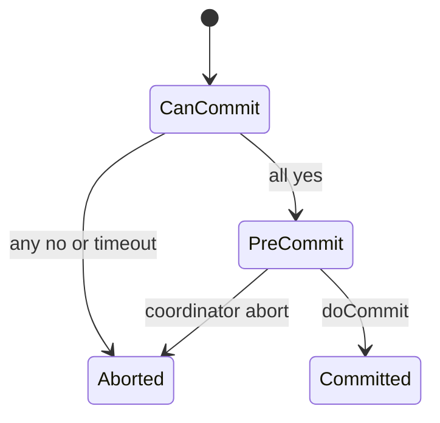

import { ConceptTemplate } from '@/features/kb/components/templates/ConceptTemplate'
import { Callout } from '@/features/kb/components/mdx/Callout'
import { ComparisonTable } from '@/features/kb/components/mdx/ComparisonTable'

export default function Layout({ children }) {
  return (
    <ConceptTemplate title="Three-Phase Commit (3PC)">
      {children}
    </ConceptTemplate>
  )
}

**Three-phase commit** adds a **pre-commit** (prepared-to-commit) phase so that, in a synchronous failure model, a surviving cohort can decide without blocking forever on a dead coordinator. In real networks with partitions, 3PC can still block or decide inconsistently unless you add extra assumptions. Production systems almost never ship textbook 3PC.

## 1. Deep Dive and Mechanics

**Phases.** CanCommit (vote), PreCommit (coordinator learned yes from all), DoCommit. Participants that see PreCommit know that everyone voted yes, so a timeout after PreCommit can commit. Participants that never left CanCommit can abort.

**The hope.** 2PC blocks if the coordinator dies after some participants prepared. 3PC tries to make the recovery rule local.

**The catch.** If the network partitions, one side may PreCommit and commit while the other never heard PreCommit and aborts. Skeen's conditions assume no partitions or a synchronous model. That is not the WAN.

<Callout icon="warning" title="3PC is not the fix for 2PC on microservices">
If you need progress under partitions, use consensus (Paxos/Raft) for a commit record, or use sagas. Do not add a third network round and call it solved.
</Callout>

## 2. Mathematical / Theoretical Foundation

Skeen: a non-blocking atomic commit protocol exists in a synchronous model with reliable failure detection. In an asynchronous network, atomic commit is as hard as consensus. 3PC's extra state does not beat FLP or CAP.

Timeout-based "I am the new coordinator" without a quorum is how split decisions happen.

<ComparisonTable
  headers={['Protocol', 'Rounds', 'Blocking', 'Partition story']}
  rows={[
    ['2PC', '2', 'Yes if coordinator gone', 'Unsafe if you guess'],
    ['3PC', '3', 'Better in sync model', 'Can split on a cut'],
    ['Paxos commit', 'Consensus', 'Live with majority', 'Minority waits'],
    ['Saga', 'N local', 'No global lock', 'Compensations'],
  ]}
/>

## 3. Real-World Implementation

```python
STATES = ("working", "prepared", "precommitted", "committed", "aborted")
```

If you find a 3PC library, treat it as a history lesson. XA in databases is still 2PC. Cloud orchestrators use logs, not 3PC.

## 4. Visualizations



## 5. Interview Prep

**Q: Why did people invent 3PC?**
**A:** To reduce blocking when the coordinator crashes after a unanimous yes. It assumes you can tell crash from delay.

**Q: Why don't we use it?**
**A:** Partitions look like crashes. Extra latency. Consensus on a transaction log is the robust version of "non-blocking commit."

**Q: Is Spanner 3PC?**
**A:** No. Spanner uses Paxos per group and 2PC across groups, with TrueTime to bound uncertainty.

## 6. Production Use Cases

- **Exam answers** and protocol surveys.
- **Not** a recommended cross-service default.
- **Historical papers** next to 2PC and Paxos commit.

<Callout icon="tip" title="Say 2PC then consensus then saga">
That ranking is what interviewers want. 3PC is the footnote.
</Callout>
