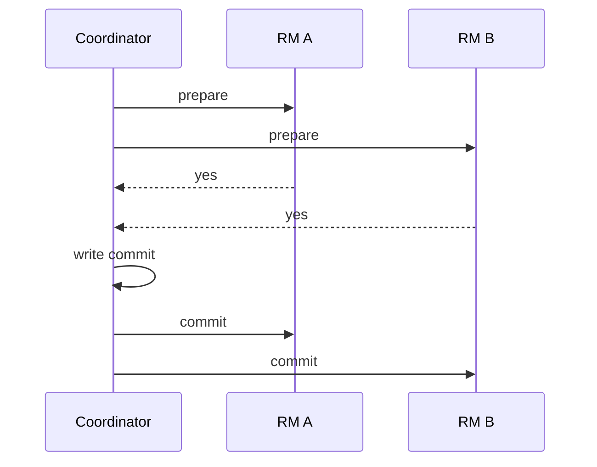

import { ConceptTemplate } from '@/features/kb/components/templates/ConceptTemplate'
import { Callout } from '@/features/kb/components/mdx/Callout'
import { ComparisonTable } from '@/features/kb/components/mdx/ComparisonTable'

export default function Layout({ children }) {
  return (
    <ConceptTemplate title="Two-Phase Commit (2PC)">
      {children}
    </ConceptTemplate>
  )
}

**Two-phase commit** is the classic atomic commit protocol. In **prepare**, every resource manager votes yes (durable prepared state, locks held) or no. In **commit**, the coordinator writes a decision and tells everyone. All yes plus a commit record means commit; any no means abort.

## 1. Deep Dive and Mechanics

**Coordinator.** Collects votes, persists the decision, then informs participants. The commit record is the truth. If the coordinator dies after writing commit, recovery must finish the commit, not abort.

**Participants.** On yes, they cannot forget: they must be able to commit or abort when told. That is why locks and undo/redo live across the wait.

**Blocking.** If the coordinator vanishes after some prepared yes votes, participants cannot safely pick a side without talking to someone who saw the decision. This is the famous 2PC block.

**XA.** Databases expose this as XA transactions. It works inside one vendor's RM set. Across microservices with HTTP, 2PC becomes a distributed lock on the user request.

<Callout icon="warning" title="Prepared is not committed">
A process that crashes in prepare must still be able to abort or commit on recovery. If you ack yes before the prepare record is durable, you can commit on one side and lose the other.
</Callout>

## 2. Mathematical / Theoretical Foundation

Atomic commit: all correct participants decide the same, commit only if all voted yes, and (in a good run) commit when all voted yes and no failures. Gray and others showed 2PC is blocking. Non-blocking atomic commit needs extra models or consensus.

Latency is at least two extra round trips plus fsyncs on every participant.

<ComparisonTable
  headers={['Concern', '2PC', 'Saga', 'Consensus log']}
  rows={[
    ['Atomicity', 'Yes', 'Compensation', 'Yes for one log'],
    ['Lock time', 'Until decision', 'Local only', 'Until commit index'],
    ['Partition', 'Blocks', 'Diverges then repairs', 'Majority progress'],
    ['Ops cost', 'Dreaded', 'Workflow ops', 'Well understood'],
  ]}
/>

## 3. Real-World Implementation

```python
def two_phase(participants):
    votes = [p.prepare() for p in participants]
    if all(votes):
        for p in participants:
            p.commit()
        return "commit"
    for p in participants:
        p.abort()
    return "abort"
```

Real coordinators persist the decision before the second loop. The in-memory version is a teaching sketch.

## 4. Visualizations



## 5. Interview Prep

**Q: When is 2PC acceptable?**
**A:** Short transactions, one data-center, participants that share an XA coordinator, and a team that can unblock in-doubt transactions. Not as the default between HTTP services.

**Q: What is an in-doubt transaction?**
**A:** A participant that voted yes and has not heard the decision. DBAs resolve these with the coordinator log.

**Q: 2PC versus Raft?**
**A:** Raft replicates one state machine. 2PC spans independently prepared resources. Spanner uses both: Paxos inside a group, 2PC across groups.

## 6. Production Use Cases

- **XA between a database and a message broker** in older enterprise apps.
- **Spanner / Cockroach** distributed SQL commit (with consensus underneath).
- **Avoid** for checkout across five microservices; use a saga.

<Callout icon="tip" title="Measure prepare time">
If prepare waits on a user or an external HTTP call, you have locked rows across a WAN. That is the 2PC outage story.
</Callout>
