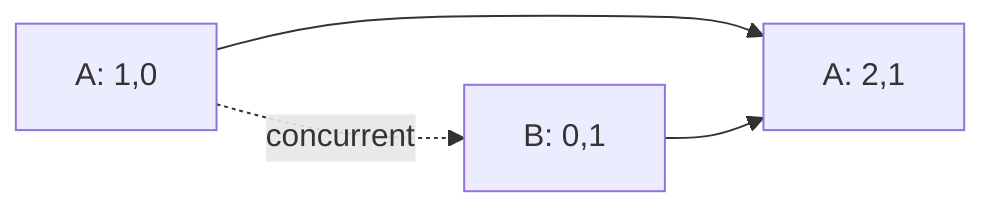

import { ConceptTemplate } from '@/features/kb/components/templates/ConceptTemplate'
import { Callout } from '@/features/kb/components/mdx/Callout'
import { ComparisonTable } from '@/features/kb/components/mdx/ComparisonTable'

export default function Layout({ children }) {
  return (
    <ConceptTemplate title="Vector Clocks">
      {children}
    </ConceptTemplate>
  )
}

A **vector clock** (or version vector) is a map from process id to counter. Increment your own slot on a local event. On receive, take the element-wise max, then increment yourself. Event a happens-before b if Va is less than or equal to Vb in every slot and strictly less in at least one. If neither dominates, the events are concurrent.

## 1. Deep Dive and Mechanics

**Why scalars fail.** Lamport clocks totally order events. Concurrent writes get an arbitrary winner under last-write-wins. Vector clocks keep both as siblings.

**Version vectors versus full vector clocks.** Stores often track one counter per replica (version vector) for a key, not a clock for every event in the system. Same dominance test.

**Growth.** One slot per writer. Churned clients explode metadata. Dynamo-style systems prune, gossip, and sometimes fall back to timestamps when the vector is too wide.

<Callout icon="info" title="Incomparable means keep both">
If neither vector dominates, do not pick a winner in the storage layer unless the product says LWW. Surface siblings to the app or a merge function.
</Callout>

## 2. Mathematical / Theoretical Foundation

Happens-before is a partial order. Vector clocks are an order-embedding into N^k (Fidge, Mattern). Dominance is componentwise. Concurrent pairs are incomparable.

Storage cost is O(n) integers per object for n writers. Dotted version vectors and interval tree clocks compress some cases.

<ComparisonTable
  headers={['Clock', 'Causality', 'Concurrency', 'Size']}
  rows={[
    ['Lamport', 'One way', 'Hidden', '1 int'],
    ['Vector / version', 'Yes', 'Yes', 'O(writers)'],
    ['LWW timestamp', 'No', 'Dropped', '1 stamp'],
    ['CRDT', 'Merge law', 'Commutes', 'Type-specific'],
  ]}
/>

## 3. Real-World Implementation

```python
def dominates(a, b):
    keys = set(a) | set(b)
    ge = all(a.get(k, 0) >= b.get(k, 0) for k in keys)
    gt = any(a.get(k, 0) > b.get(k, 0) for k in keys)
    return ge and gt

def concurrent(a, b):
    return not dominates(a, b) and not dominates(b, a)
```

Riak and classic Dynamo expose siblings this way. Cassandra mostly uses timestamps instead.

## 4. Visualizations



## 5. Interview Prep

**Q: If Va is less than Vb in every coordinate, did a happen before b?**
**A:** Yes, that is the dominance test. The Lamport trap does not apply the same way.

**Q: Why not vector clocks on every HTTP client?**
**A:** Cardinality. Prefer replica-id vectors, or a causal CRDT, or accept LWW for low-stakes fields.

**Q: Vector clock versus CRDT?**
**A:** Vectors detect conflict. CRDTs define a merge that always exists. Many CRDTs use dots (replica, counter) internally.

## 6. Production Use Cases

- **Riak / Dynamo** sibling reconciliation.
- **File sync** and multi-master documents before a CRDT.
- **Debug** of causal history in traces.

<Callout icon="tip" title="Always define the merge">
A vector without a merge function is just a way to know you are in trouble. Write the merge on the design doc.
</Callout>
