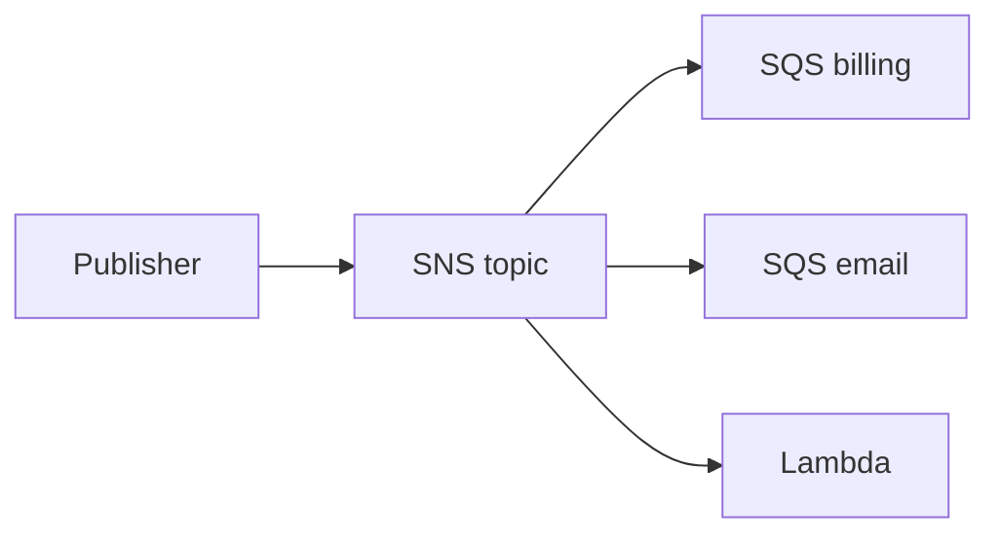

import { ConceptTemplate } from '@/features/kb/components/templates/ConceptTemplate'
import { Callout } from '@/features/kb/components/mdx/Callout'
import { ComparisonTable } from '@/features/kb/components/mdx/ComparisonTable'

export default function Layout({ children }) {
  return (
    <ConceptTemplate title="AWS SNS (Simple Notification Service)">
      {children}
    </ConceptTemplate>
  )
}

**Amazon SNS** is a pub-sub fan-out service. A publisher sends one message to a **topic**. SNS delivers copies to each **subscription**: SQS queues, Lambda, HTTPS, email, SMS, or Firehose. Publishers do not know the subscribers. That is the point.

## 1. Deep Dive and Mechanics

**Topics.** Standard topics retry and may reorder or duplicate. FIFO topics (with an SQS FIFO subscriber) keep order per message group and support exactly-once between SNS and SQS when both are FIFO.

**Fan-out.** The usual pattern is SNS to many SQS queues so each consumer team scales and fails on its own. Lambda subscribers work for small, fast handlers.

**Filtering.** Subscription filter policies drop messages the consumer does not want, so you do not pay a fleet to ignore fields.

**Delivery.** HTTPS subscribers must ack. Failed deliveries retry with backoff, then a dead-letter queue if you attach one. Email is not a system-of-record transport.

<Callout icon="warning" title="SNS is not a durable inbox for your service">
If you subscribe an HTTP URL and the app is down past retries, the message is gone unless a DLQ exists. Fan out to SQS when you need a backlog.
</Callout>

## 2. Mathematical / Theoretical Foundation

Pub-sub is a one-to-many broadcast on a topic name. Delivery is at-least-once for standard topics. Ordering is not a global clock; FIFO is per group id.

Fan-out cost is O(subscribers) publish work on the service side. Filter policies cut that for the subscriber, not for SNS's internal fan-out entirely.

<ComparisonTable
  headers={['Service', 'Model', 'Backlog', 'Typical pair']}
  rows={[
    ['SNS', 'Pub-sub', 'No (unless SQS)', 'Notify many'],
    ['SQS', 'Queue', 'Yes', 'Work items'],
    ['EventBridge', 'Event bus plus rules', 'Via targets', 'Org-wide events'],
    ['Kinesis', 'Stream', 'Yes, time/retention', 'Telemetry'],
  ]}
/>

## 3. Real-World Implementation

```python
# boto3 sketch
# sns.publish(TopicArn=arn, Message=body, MessageAttributes=attrs)
```

Put a correlation id in attributes. Subscribe SQS with raw message delivery only if you know how to parse the wrapper.

## 4. Visualizations



## 5. Interview Prep

**Q: SNS versus SQS?**
**A:** SNS fans out. SQS stores work for one consumer group. Most designs use both: SNS then SQS.

**Q: How do you get ordering?**
**A:** FIFO topic plus FIFO queue, same message group id. Throughput is lower. Standard is the default for a reason.

**Q: What happens if a subscriber is slow?**
**A:** HTTP/Lambda feel SNS retry pressure. SQS absorbs the pile. Prefer SQS for uneven consumers.

## 6. Production Use Cases

- **Fan-out of order.placed** to billing, mail, and search indexers.
- **Mobile push** and SMS (with care for consent).
- **Alarm actions** from CloudWatch.

<Callout icon="tip" title="Always attach a DLQ">
A topic without a DLQ on each critical subscription is how you lose billing events on a bad deploy.
</Callout>
