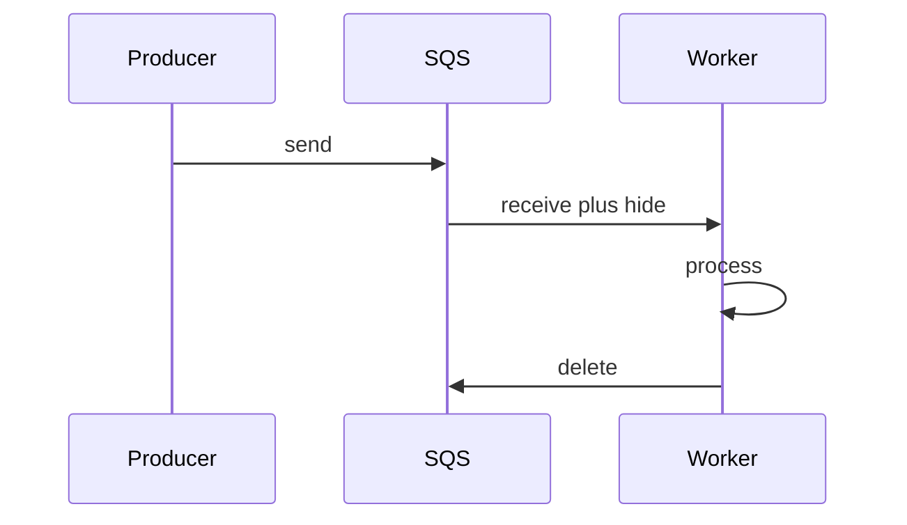

import { ConceptTemplate } from '@/features/kb/components/templates/ConceptTemplate'
import { Callout } from '@/features/kb/components/mdx/Callout'
import { ComparisonTable } from '@/features/kb/components/mdx/ComparisonTable'

export default function Layout({ children }) {
  return (
    <ConceptTemplate title="AWS SQS (Simple Queue Service)">
      {children}
    </ConceptTemplate>
  )
}

**Amazon SQS** is a hosted queue. Producers send messages. Consumers **receive**, process, then **delete**. Until delete, a **visibility timeout** hides the message so another worker should not take it. If the worker dies, the message reappears. That is at-least-once.

## 1. Deep Dive and Mechanics

**Standard queues.** Huge throughput, at-least-once, occasional reordering and rare duplicates. Design handlers to be idempotent.

**FIFO queues.** Order per message group id, exactly-once processing between SQS and a careful consumer (dedup id window). Lower throughput than standard.

**Visibility timeout.** Set it longer than p99 work time, or use heartbeats (change visibility) for long jobs. Too short means two workers do the same job.

**DLQ.** After N receives, move the message. Without a DLQ, poison pills block a FIFO group or waste workers forever.

<Callout icon="warning" title="Receive is not consume">
If you crash after the side effect and before delete, SQS will deliver again. The database write or charge must use an idempotency key.
</Callout>

## 2. Mathematical / Theoretical Foundation

A queue is a durable bag (standard) or per-group log (FIFO). Visibility is a lease: duration T. If processing time exceeds T without extend, lease expires and the message is available — the duplicate.

Backoff on receive-empty is how you avoid hot-looping. Long polling (wait time seconds up to 20) cuts empty receives.

<ComparisonTable
  headers={['Queue', 'Order', 'Dups', 'Scale']}
  rows={[
    ['SQS standard', 'Best effort', 'Yes', 'Very high'],
    ['SQS FIFO', 'Per group', 'Dedup window', 'Limited'],
    ['Kafka topic', 'Per partition', 'At-least-once', 'Very high'],
    ['Rabbit work queue', 'Per queue', 'Ack rules', 'Cluster-sized'],
  ]}
/>

## 3. Real-World Implementation

```python
def handle(msg, db):
    if db.seen(msg.dedup_id):
        return "delete"
    db.apply(msg)
    return "delete"
```

Batch receive (up to 10) and batch delete. Lambda event-source mapping hides some of this; you still need idempotency.

## 4. Visualizations



## 5. Interview Prep

**Q: Why did the job run twice?**
**A:** Visibility expired, or delete failed, or a standard-queue duplicate. All three are normal. Blame the handler if it is not idempotent.

**Q: SQS versus Kafka?**
**A:** SQS is a queue (competing consumers, delete on success). Kafka is a retained log (many consumer groups, offset). Pick Kafka when several teams independently replay.

**Q: How do you delay a retry?**
**A:** Visibility extend, delay seconds on send, or a delay queue plus DLQ hop. Do not sleep inside a Lambda far past timeout.

## 6. Production Use Cases

- **Async workers** behind APIs (thumbnails, mail, ETL).
- **SNS fan-out** target per team.
- **Decoupling autoscaling** producers from slow consumers.

<Callout icon="tip" title="Alarm on DLQ depth and age">
Oldest message age is the SLO, not just ApproximateNumberOfMessages.
</Callout>
