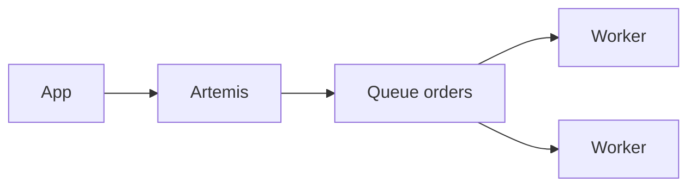

import { ConceptTemplate } from '@/features/kb/components/templates/ConceptTemplate'
import { Callout } from '@/features/kb/components/mdx/Callout'
import { ComparisonTable } from '@/features/kb/components/mdx/ComparisonTable'

export default function Layout({ children }) {
  return (
    <ConceptTemplate title="Apache ActiveMQ">
      {children}
    </ConceptTemplate>
  )
}

**Apache ActiveMQ** is a message broker in the JMS world. **Classic** is the older broker. **Artemis** is the newer core (donated HornetQ) and is what new deployments should mean. Clients open sessions, send to queues or topics, and ack according to JMS modes.

## 1. Deep Dive and Mechanics

**Queues versus topics.** Queue: competing consumers, one delivery of each message to one consumer. Topic: pub-sub. Durable topic subscriptions keep a backlog for an offline subscriber.

**JMS sessions.** AUTO_ACK, CLIENT_ACK, and transacted sessions change when a message is considered consumed. Transacted sessions pair well with a JDBC XA story — and with 2PC pain.

**Persistence.** Journal plus optional JDBC. Throughput dies if every message fsyncs through a remote database. Local journal is the default for speed.

**Artemis clustering.** Shared-nothing replication or shared store. Classic's network-of-brokers is a different, older model. Do not mix lore.

<Callout icon="info" title="ActiveMQ is not Kafka">
No long retained log for independent replay by many consumer groups. If that is the requirement, you picked the wrong broker.
</Callout>

## 2. Mathematical / Theoretical Foundation

JMS delivery is at-least-once with client ack; exactly-once needs a transaction that includes the consume and the side effect. Prefetch is a window: large prefetch raises throughput and duplicate risk on crash.

<ComparisonTable
  headers={['Broker', 'API', 'Strength', 'Watch-out']}
  rows={[
    ['ActiveMQ Artemis', 'JMS, core, AMQP', 'Java shops', 'Ops of the cluster'],
    ['RabbitMQ', 'AMQP 0-9-1', 'Routing, ops story', 'Not a log'],
    ['IBM MQ', 'JMS, MQ', 'Mainframe edges', 'License'],
    ['Kafka', 'Log API', 'Replay, scale', 'Not JMS queues'],
  ]}
/>

## 3. Real-World Implementation

```java
// session.createQueue("orders");
// producer.send(session.createTextMessage(json));
```

Cap prefetch. Set redelivery delay. Send poison messages to a DLQ after a bound.

## 4. Visualizations



## 5. Interview Prep

**Q: Classic versus Artemis?**
**A:** Artemis is the current broker. Classic remains in old plants. New clusters should be Artemis unless a vendor pins Classic.

**Q: Durable subscription versus queue?**
**A:** Durable topic keeps per-subscriber cursors on a broadcast. A queue shares work. Pick queue for workers, topic for events.

**Q: How do you HA?**
**A:** Live-backup replication (Artemis) or a shared store. Test failover with in-flight acks; that is where dups appear.

## 6. Production Use Cases

- **Spring / Java EE** apps that already use JMS templates.
- **Bridge** to AMQP or STOMP clients.
- **Gradual migrate** off Classic onto Artemis or out to Kafka/SQS.

<Callout icon="tip" title="Treat the journal disk as sacred">
Broker disk full is a total outage. Alert before the volume hits 80 percent.
</Callout>
