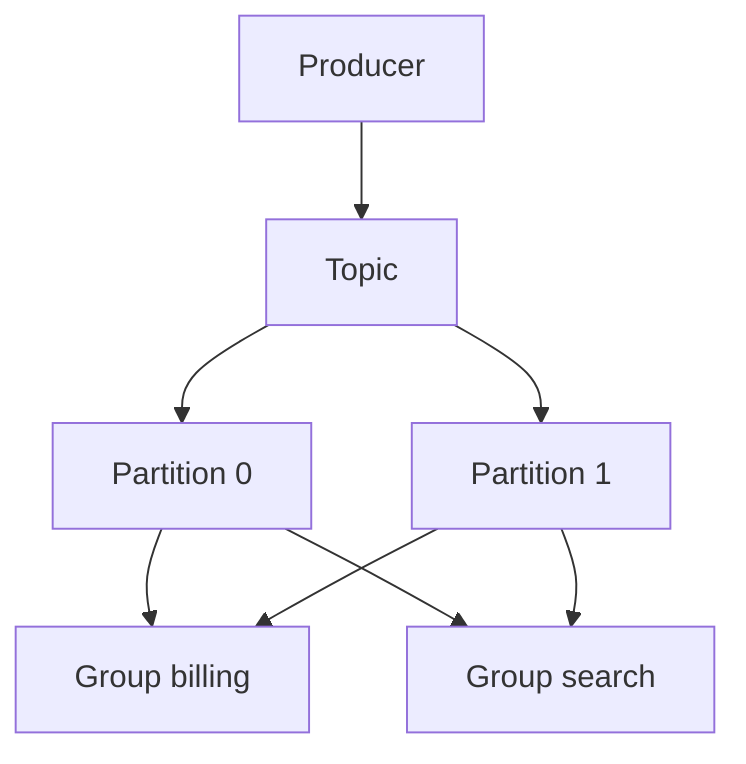

import { ConceptTemplate } from '@/features/kb/components/templates/ConceptTemplate'
import { Callout } from '@/features/kb/components/mdx/Callout'
import { ComparisonTable } from '@/features/kb/components/mdx/ComparisonTable'

export default function Layout({ children }) {
  return (
    <ConceptTemplate title="Apache Kafka">
      {children}
    </ConceptTemplate>
  )
}

**Apache Kafka** is a distributed **log**. Producers append records to a **topic**. A topic is split into **partitions**. Each partition is an ordered, immutable sequence with an offset. Consumer groups share partitions; different groups each replay the same log.

## 1. Deep Dive and Mechanics

**Partitions.** Parallelism unit. Order is guaranteed inside one partition, not across the topic. Keys hash to a partition so the same key stays ordered.

**ISR.** In-sync replicas. acks=all waits for the ISR. A replica that falls behind leaves the ISR; min.insync.replicas stops writes if too few remain.

**Consumers.** A group assigns each partition to one member. Commit offsets (auto or manual). Replay by seeking. Compaction keeps the latest value per key for changelog topics.

**Kafka versus a queue.** Kafka does not delete on consume. Retention is time, size, or compaction. That is why search and billing can both read orders.

<Callout icon="warning" title="acks=1 is not durable">
If the leader dies before followers have the record, the message can vanish. Use acks=all and a sensible min.insync.replicas for money events.
</Callout>

## 2. Mathematical / Theoretical Foundation

A partition is a totally ordered sequence. Throughput scales roughly with partition count if keys are balanced. Hot keys pin a partition.

End-to-end exactly-once needs idempotent producers plus transactional produce and consume (Kafka EOS). Most apps still do at-least-once plus idempotent writes.

<ComparisonTable
  headers={['Piece', 'Guarantees', 'Failure mode']}
  rows={[
    ['Partition log', 'Order, offset', 'Hot key, rebalance stall'],
    ['ISR + acks=all', 'No ack if under-replicated', 'Write unavailability'],
    ['Consumer group', 'Shared work', 'Stop-the-world rebalance'],
    ['Compaction', 'Latest per key', 'Not a full history'],
  ]}
/>

## 3. Real-World Implementation

```python
# producer.send("orders", key=user_id, value=payload)
# consumer.subscribe(["orders"]); consumer.commit() after DB write
```

Commit the offset only after the side effect. Store the offset in the same DB transaction when you can (outbox or transactional consume).

## 4. Visualizations



## 5. Interview Prep

**Q: How do you keep order for a user?**
**A:** Same key, hence same partition. Do not expect global order. If you need it, you need one partition — and a throughput cap.

**Q: What is a rebalance?**
**A:** Group membership change. Partitions pause and move. Cooperative sticky assignors reduce the pause. Long processing plus auto-commit is how you double-process.

**Q: Kafka versus Pulsar versus Kinesis?**
**A:** Same log idea. Kafka is the default ops skill. Kinesis is managed AWS shards. Pulsar separates storage (BookKeeper) and has first-class multi-tenancy.

## 6. Production Use Cases

- **Event backbone** for domain events and CDC (Debezium).
- **Stream processing** (Flink, Kafka Streams).
- **Changelog** for materialized views.

<Callout icon="tip" title="Partition count is a one-way door">
You can add partitions; you cannot re-order history. Start from expected throughput and key cardinality, then add headroom.
</Callout>
