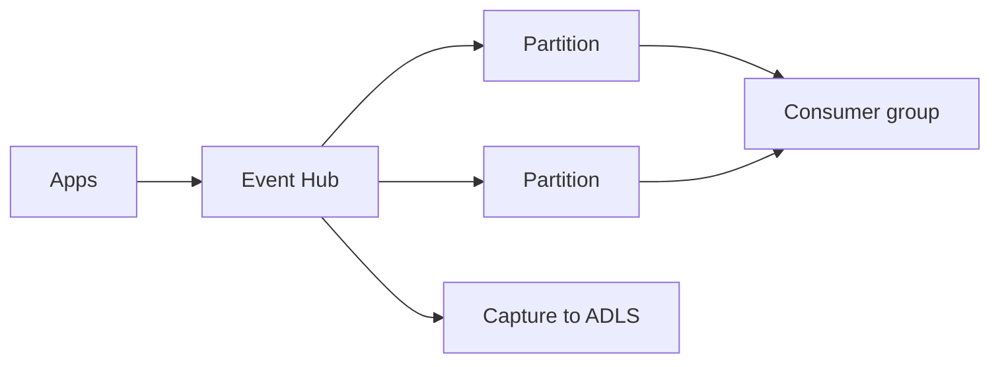

import { ConceptTemplate } from '@/features/kb/components/templates/ConceptTemplate'
import { Callout } from '@/features/kb/components/mdx/Callout'
import { ComparisonTable } from '@/features/kb/components/mdx/ComparisonTable'

export default function Layout({ children }) {
  return (
    <ConceptTemplate title="Azure Event Hubs">
      {children}
    </ConceptTemplate>
  )
}

**Azure Event Hubs** is a managed ingestion log. Producers send events into a namespace and hub. The hub is split into **partitions**. **Consumer groups** each read independently. The Kafka endpoint lets existing Kafka clients talk to Event Hubs with some feature gaps.

## 1. Deep Dive and Mechanics

**Throughput units / processing units / capacity.** You buy ingress. Throttle is a first-class outage mode. Autoscale exists; it is not instant.

**Partitions.** Choose at create time (can scale out on some SKUs). Partition key affinity keeps order per key, same as Kafka.

**Capture.** Optional archive to Blob or ADLS as a batch dump — good for lake ingestion without a long consumer.

**Checkpoints.** Event processor hosts store offsets in Blob. If you do not checkpoint, restarts replay from the beginning or from retention, depending on config.

<Callout icon="info" title="Event Hubs is not Service Bus">
Hubs are telemetry streams. Service Bus is queues, sessions, and business messaging. Mixing them in a design review is a common miss.
</Callout>

## 2. Mathematical / Theoretical Foundation

Same log math as Kafka: order per partition, scale by partition count, retention by time/size. Consumer lag is latest offset minus checkpoint.

Kafka compatibility is a protocol mapping, not a full Apache Kafka cluster. Compacted topics and some admin APIs differ.

<ComparisonTable
  headers={['Azure piece', 'Model', 'Use']}
  rows={[
    ['Event Hubs', 'Log, partitions', 'Telemetry, clickstream'],
    ['Service Bus queue', 'Competing consumers', 'Commands, jobs'],
    ['Service Bus topic', 'Pub-sub', 'Fan-out business events'],
    ['Event Grid', 'Reactive routing', 'Blob created, SaaS events'],
  ]}
/>

## 3. Real-World Implementation

```csharp
// EventHubProducerClient.SendAsync(batch);
// EventProcessorClient with Blob checkpoint store
```

Batch sends. Handle PartitionOwnership. Do not checkpoint before the DB write.

## 4. Visualizations



## 5. Interview Prep

**Q: Kafka on Event Hubs — any catch?**
**A:** It works for many produce/consume paths. Test compaction, transactions, and admin tools. Do not assume every Kafka feature exists.

**Q: How many partitions?**
**A:** Ingress target divided by per-partition limits, plus consumer parallelism. Too few and you throttle; too many and you pay and rebalance more.

**Q: Event Hubs versus Kinesis?**
**A:** Same niche on different clouds. Checkpoint stores and IAM differ. The design picture is identical.

## 6. Production Use Cases

- **IoT and click** ingestion.
- **Pipeline into Azure Stream Analytics or Spark**.
- **Capture** as a cheap lake feed.

<Callout icon="tip" title="Alert on throttled bytes">
Throttling looks like random timeouts in clients. Watch the metric before you scale the app.
</Callout>
