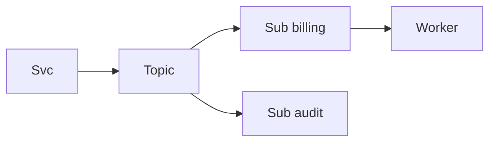

import { ConceptTemplate } from '@/features/kb/components/templates/ConceptTemplate'
import { Callout } from '@/features/kb/components/mdx/Callout'
import { ComparisonTable } from '@/features/kb/components/mdx/ComparisonTable'

export default function Layout({ children }) {
  return (
    <ConceptTemplate title="Azure Service Bus">
      {children}
    </ConceptTemplate>
  )
}

**Azure Service Bus** is a managed AMQP broker for **business messages**. **Queues** give competing consumers. **Topics** plus **subscriptions** give pub-sub with SQL-style filters. **Sessions** keep order for a session id. **Peek-lock** is the visibility lease.

## 1. Deep Dive and Mechanics

**Peek-lock.** Receive locks the message. Complete deletes it. Abandon or lock expiry puts it back. Dead-letter after max delivery count.

**Sessions.** A session id pins ordered handling to one receiver at a time. Useful for per-user workflows. Throughput is per session, not global.

**Duplicate detection.** A window on message id so retries from the producer do not enqueue twice. It is not exactly-once end to end.

**Transactions.** Limited local transactions (complete plus send). Not a distributed saga replacement.

<Callout icon="warning" title="Lock expiry duplicates work">
Long handlers must renew the lock. Otherwise two workers will process the same payment instruction.
</Callout>

## 2. Mathematical / Theoretical Foundation

At-least-once with a lease of duration T. FIFO is per session, not per queue, unless you use one session. Filters on subscriptions are predicates evaluated at enqueue/fan-out time.

<ComparisonTable
  headers={['Feature', 'Service Bus', 'SQS', 'Event Hubs']}
  rows={[
    ['Queue', 'Yes', 'Yes', 'No'],
    ['Pub-sub filters', 'Rich', 'Via SNS', 'Consumer side'],
    ['Sessions / FIFO', 'Sessions', 'FIFO groups', 'Partition key'],
    ['Telemetry volume', 'Poor fit', 'OK', 'Yes'],
  ]}
/>

## 3. Real-World Implementation

```csharp
// processor.ProcessMessageAsync += ...; args.CompleteMessageAsync(args.Message)
```

Use the processor SDK so lock renewal is not a hand-rolled timer you forget.

## 4. Visualizations



## 5. Interview Prep

**Q: Service Bus versus Event Hubs?**
**A:** Commands, workflows, and filters: Service Bus. High-rate telemetry: Event Hubs. Do not ingest clickstreams on Service Bus.

**Q: How do you order per customer?**
**A:** Session id = customer id. One active processor per session. Watch session count as a scale limit.

**Q: Premium versus standard?**
**A:** Premium has reserved capacity, larger messages, and better isolation. Standard can noisy-neighbor under burst.

## 6. Production Use Cases

- **Order and payment commands** in Azure-native apps.
- **Topic fan-out** with per-team subscriptions.
- **Bridge** from on-prem AMQP.

<Callout icon="tip" title="Dead-letter is a product backlog">
Someone must own the DLQ. A full DLQ with no owner is a silent business outage.
</Callout>
