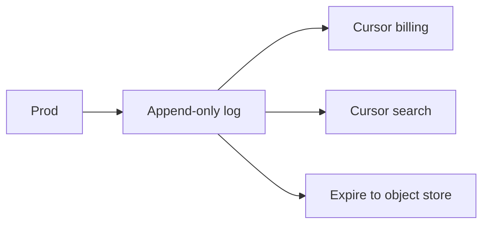

import { ConceptTemplate } from '@/features/kb/components/templates/ConceptTemplate'
import { Callout } from '@/features/kb/components/mdx/Callout'
import { ComparisonTable } from '@/features/kb/components/mdx/ComparisonTable'

export default function Layout({ children }) {
  return (
    <ConceptTemplate title="Event Streams">
      {children}
    </ConceptTemplate>
  )
}

An **event stream** is an append-only log of facts: orders, clicks, CDC rows. Producers append. Consumers keep a **cursor** (offset, timestamp). The log remains for a retention window so new consumers can catch up. This is different from a queue, where consume removes the message from the shared backlog.

## 1. Deep Dive and Mechanics

**Facts versus commands.** A stream of OrderPlaced is a fact. A queue of SendEmail is a command. Facts can have many readers. Commands should have one successful worker.

**Partitions and keys.** Same key, same ordered slice. Global order is rare and expensive.

**Retention and compaction.** Time/size retention is history with a hole after expiry. Compaction keeps the latest state per key (KTables, changelogs).

**Replay.** The defining operation. A new indexer rebuilds from offset zero (or from a snapshot plus tail).

<Callout icon="info" title="A stream is not your warehouse">
Retention of days is not a seven-year audit store. Dump to object storage if you need forever.
</Callout>

## 2. Mathematical / Theoretical Foundation

A stream is a function from offset to record, monotonic append. Consumer lag = high-water mark minus committed cursor. Throughput is limited by the hottest partition.

Exactly-once across stream and database is a transaction or an idempotent apply. The stream alone does not make the DB exactly-once.

<ComparisonTable
  headers={['', 'Event stream', 'Message queue']}
  rows={[
    ['Remove on consume', 'No', 'Yes'],
    ['Many independent readers', 'Yes', 'Awkward'],
    ['Replay', 'Native', 'Only if you recopy'],
    ['Per-key order', 'Partition', 'FIFO group / session'],
  ]}
/>

## 3. Real-World Implementation

```python
def apply_until(log, cursor, handler):
    for offset, rec in log.after(cursor):
        handler(rec)
        cursor = offset
    return cursor
```

Checkpoint after a durable side effect, or in the same transaction.

## 4. Visualizations



## 5. Interview Prep

**Q: Stream versus queue in a design interview?**
**A:** Several teams must read the same history: stream. One worker pool must do a job: queue. Many systems have both.

**Q: What is a watermark?**
**A:** In stream processing, a time threshold that says "we believe no earlier event will arrive." Used to close windows. It can be wrong; late data needs a policy.

**Q: How do you handle poison events?**
**A:** Skip with a DLQ topic, or park the partition (halts everything on that key). Prefer a DLQ plus an alert.

## 6. Production Use Cases

- **Kafka / Kinesis / Event Hubs / Pulsar** backbones.
- **CDC** streams into search and warehouses.
- **Materialized views** built by replaying.

<Callout icon="tip" title="Name the cursor store">
Offsets in the broker, in Redis, or in the DB — pick one and make it crash-safe.
</Callout>
