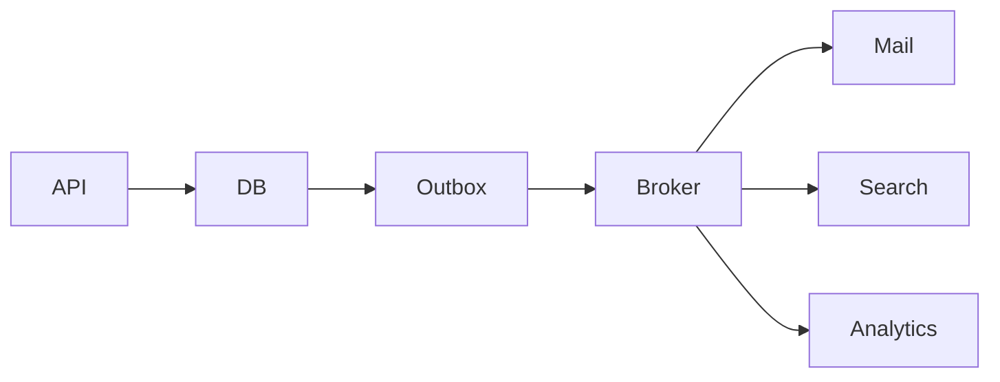

import { ConceptTemplate } from '@/features/kb/components/templates/ConceptTemplate'
import { Callout } from '@/features/kb/components/mdx/Callout'
import { ComparisonTable } from '@/features/kb/components/mdx/ComparisonTable'

export default function Layout({ children }) {
  return (
    <ConceptTemplate title="Event-Driven Architecture (EDA)">
      {children}
    </ConceptTemplate>
  )
}

**Event-driven architecture** means a component announces that something happened and does not wait for every listener. Listeners react, often through a broker or stream. The alternative is a synchronous chain of HTTP calls that fails when any hop is down.

## 1. Deep Dive and Mechanics

**Notification events.** Small "something changed, go look" messages. Easy, chatty, and racy if the look-up hits a replica that is behind.

**Event-carried state transfer.** The payload has the fields consumers need. Consumers can be autonomous. Schema becomes a contract (Avro, JSON Schema, Protobuf).

**Event sourcing.** The log is the store; current state is a fold. Powerful and easy to get wrong (PII, versioning, GDPR erase).

**Choreography versus orchestration.** EDA leans choreography. Add an orchestrator when the business process has a name and a compensation path.

<Callout icon="warning" title="Async does not remove coupling">
You still couple on event names and schemas. A rename can break five teams. Own a catalog and compatibility rules.
</Callout>

## 2. Mathematical / Theoretical Foundation

Causality is a partial order on events. Consumers that need "A then B" must share a partition key or use sagas. Dual writes (DB then publish) lose events unless you use an outbox.

End-to-end latency is queueing delay plus process time, not one RTT. Tail latency is dominated by retries and lag.

<ComparisonTable
  headers={['Style', 'Coupling', 'Failure', 'Best for']}
  rows={[
    ['Sync RPC chain', 'Runtime + API', 'Caller sees it', 'User-facing read'],
    ['EDA notification', 'Name + fetch', 'Listener lag', 'Simple hooks'],
    ['EDA with payload', 'Schema', 'Independent scale', 'Integrations'],
    ['Orchestrated saga', 'Process model', 'Compensations', 'Booked workflows'],
  ]}
/>

## 3. Real-World Implementation

```python
# outbox in the same DB transaction as the write
# poller or CDC publishes to the broker
```

Never publish then write, or write then publish without an outbox. Pick one atomic place.

## 4. Visualizations



## 5. Interview Prep

**Q: When is EDA the wrong tool?**
**A:** The user must see a consistent result in one request (authz check, unique username). Also when the team cannot operate a broker.

**Q: How do you debug a flow?**
**A:** Correlation ids on every event, a trace that follows produce/consume, and a catalog of producers. Without ids, you grep and pray.

**Q: Dual write problem?**
**A:** Two stores cannot commit as one. Use transactional outbox or CDC from the WAL.

## 6. Production Use Cases

- **Commerce**: order events into many departments.
- **Platforms** that add consumers without changing the producer.
- **CQRS** read models fed by events.

<Callout icon="tip" title="Start with one event and two consumers">
A twelve-service choreography on day one is how EDA gets a bad name.
</Callout>
