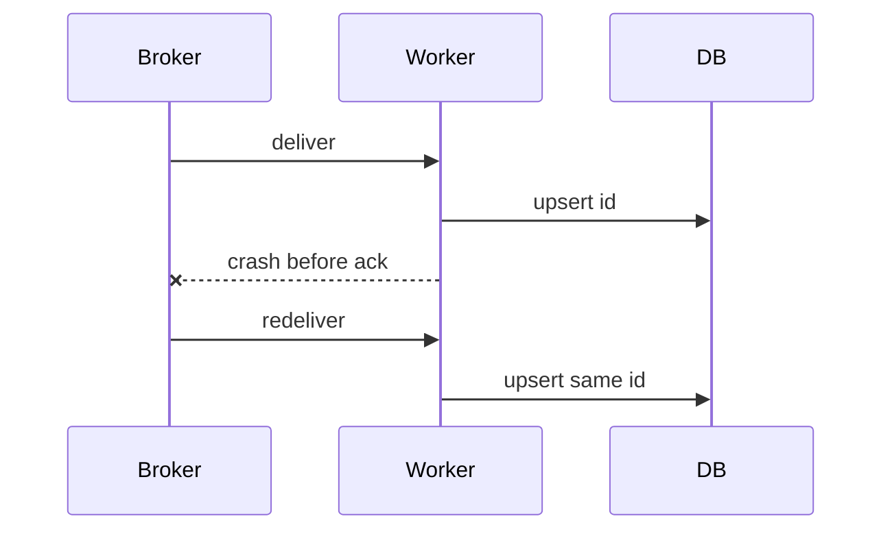

import { ConceptTemplate } from '@/features/kb/components/templates/ConceptTemplate'
import { Callout } from '@/features/kb/components/mdx/Callout'
import { ComparisonTable } from '@/features/kb/components/mdx/ComparisonTable'

export default function Layout({ children }) {
  return (
    <ConceptTemplate title="Delivery Semantics">
      {children}
    </ConceptTemplate>
  )
}

Brokers advertise **delivery semantics**. **At-most-once** sends and forgets; crashes lose messages. **At-least-once** retries until ack; crashes duplicate. **Exactly-once** means the side effect happens once, which is a property of the whole path (producer, log, consumer, database), not of a single "EOS" flag.

## 1. Deep Dive and Mechanics

**At-least-once** is the default that scales. You make it safe with idempotency keys, unique constraints, and upserts.

**Broker exactly-once** (Kafka transactions, some JMS XA) prevents duplicates inside the log or between consume and produce. It does not update your Postgres by magic.

**Effectively once.** Dedup table with a TTL, or a unique payment intent id. This is what most companies ship.

**At-most-once.** Metrics you can drop, or fire-and-forget logs. Never money.

<Callout icon="warning" title="Exactly-once is not a checkbox on the queue UI">
If the consumer writes to two systems, you still have a dual-write problem. Name the transaction boundary.
</Callout>

## 2. Mathematical / Theoretical Foundation

In an unreliable network, you cannot know whether the other side applied a request if the ack is lost. Retries are required for liveness; retries create duplicates. Exactly-once = at-least-once + idempotent apply (or a distributed transaction).

Idempotence: f(f(x)) = f(x). Unique keys implement that for inserts.

<ComparisonTable
  headers={['Semantic', 'Lose msgs', 'Dup side effects', 'Use']}
  rows={[
    ['At-most-once', 'Yes', 'No', 'Metrics'],
    ['At-least-once', 'No', 'Yes unless idempotent', 'Default'],
    ['Exactly-once end to end', 'No', 'No', 'Hard, narrow path'],
    ['Effectively once', 'No', 'No after dedup', 'Payments, mail'],
  ]}
/>

## 3. Real-World Implementation

```python
def apply_once(db, key, fn):
    if db.insert_dedup(key):
        fn()
```

insert_dedup must be unique-constrained. A check-then-act without a unique index will race.

## 4. Visualizations



## 5. Interview Prep

**Q: Does Kafka exactly-once mean my DB is safe?**
**A:** Only if the DB write is inside the same Kafka transaction story (or you consume transactionally into Kafka only). A separate SQL insert still needs a key.

**Q: Why not at-most-once for jobs?**
**A:** A deploy mid-send drops the job. Users see missing orders. Retries plus idempotency are cheaper than support tickets.

**Q: What is a poison message?**
**A:** A record that always crashes the handler. At-least-once will retry forever unless you have a DLQ and a max hop.

## 6. Production Use Cases

- **Payments**: intent id, unique charge.
- **Email**: message id, provider idempotency.
- **Kafka Streams EOS** for read-process-write in Kafka only.

<Callout icon="tip" title="Write the idempotency key on the whiteboard">
If you cannot name the key, you do not have exactly-once. You have hope.
</Callout>
