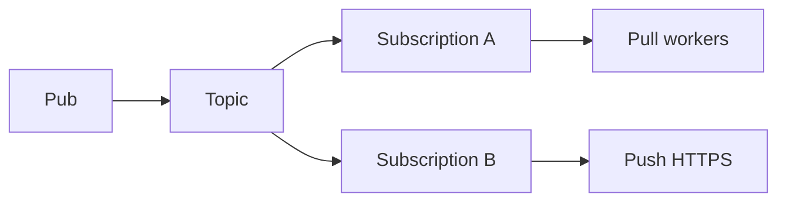

import { ConceptTemplate } from '@/features/kb/components/templates/ConceptTemplate'
import { Callout } from '@/features/kb/components/mdx/Callout'
import { ComparisonTable } from '@/features/kb/components/mdx/ComparisonTable'

export default function Layout({ children }) {
  return (
    <ConceptTemplate title="Google Cloud Pub/Sub">
      {children}
    </ConceptTemplate>
  )
}

**Google Cloud Pub/Sub** is a managed pub-sub. Publishers send to a **topic**. Each **subscription** gets its own backlog (push or pull). Ack **deadlines** work like a visibility timeout. Regional or global topics change latency and failure domains.

## 1. Deep Dive and Mechanics

**Pull versus push.** Pull: workers request messages. Push: Pub/Sub POSTs to your URL. Push needs auth and a handler that acks by HTTP status.

**Ack deadline.** Extend for long work. Expiry redelivers. Exactly-once subscriptions (where enabled) reduce duplicates on the ack path; your DB still needs a key.

**Ordering keys.** Same key, same ordering in a subscription, at a throughput cost. No key means no order.

**Seek and snapshots.** Replay a subscription to a time or snapshot. This is closer to a stream cursor than classic SQS.

<Callout icon="info" title="A topic with no subscription drops publishes">
Messages need a subscription at publish time (or they are discarded). Create the sub before you produce, or use a catch-all.
</Callout>

## 2. Mathematical / Theoretical Foundation

Each subscription is an independent cursor over the topic. At-least-once is the base. Ordering is per key, not global. Flow control limits outstanding messages so memory stays bounded (backpressure).

<ComparisonTable
  headers={['Cloud pub-sub', 'Backlog per subscriber', 'Order', 'Notes']}
  rows={[
    ['GCP Pub/Sub', 'Yes', 'Optional keys', 'Seek/snapshots'],
    ['AWS SNS', 'No (use SQS)', 'FIFO pair', 'Fan-out primitive'],
    ['AWS SQS', 'Yes (queue)', 'FIFO groups', 'Not pub-sub alone'],
    ['Azure Service Bus', 'Yes', 'Sessions', 'AMQP business msgs'],
  ]}
/>

## 3. Real-World Implementation

```python
# subscriber.subscribe(sub, callback=handler)
# message.ack() after durable write
```

Use flow-control max outstanding. Nack or extend instead of sleeping past the deadline.

## 4. Visualizations



## 5. Interview Prep

**Q: Pub/Sub versus Kafka on GCP?**
**A:** Pub/Sub is fully managed and global-first. Kafka (or Managed Kafka / Pub/Sub Lite / Dataflow) fits when you need partitions you control and a Kafka ecosystem. Lite is a cheaper, zonal option.

**Q: Why duplicates with exactly-once on?**
**A:** Publisher retries, handler crashes after side effect, or a feature gap on the API you used. Still write idempotent handlers.

**Q: Push or pull?**
**A:** Pull for workers you scale. Push for simple endpoints and Cloud Functions, with care for retry storms.

## 6. Production Use Cases

- **GCP-native microservices** fan-out.
- **Dataflow** pipelines as a subscriber.
- **Push to Cloud Run** for small event handlers.

<Callout icon="tip" title="Alert on oldest unacked">
Subscription oldest age is the business lag metric. Depth alone hides a stuck key.
</Callout>
