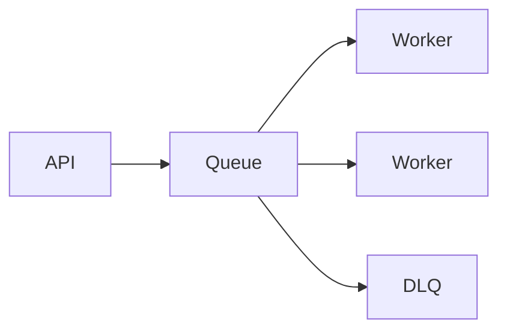

import { ConceptTemplate } from '@/features/kb/components/templates/ConceptTemplate'
import { Callout } from '@/features/kb/components/mdx/Callout'
import { ComparisonTable } from '@/features/kb/components/mdx/ComparisonTable'

export default function Layout({ children }) {
  return (
    <ConceptTemplate title="Message Queues">
      {children}
    </ConceptTemplate>
  )
}

A **message queue** stores work items until a consumer **acks**. Producers do not wait for the worker. Several workers compete; each message should be processed by one success path (plus retries). The queue absorbs bursts and outages.

## 1. Deep Dive and Mechanics

**Lifecycle.** Enqueue, lease (visibility), process, ack (delete) or fail (retry / DLQ). Crash before ack = redelivery.

**Competing consumers.** Scale by adding workers. Order is usually lost unless you add FIFO groups or sessions.

**Backpressure.** When the queue grows, producers should slow down or shed. A queue without a max depth is an unbounded memory leak on disk.

**Poison messages.** A payload that always crashes the worker. Max-receive plus DLQ is mandatory.

<Callout icon="info" title="A queue hides the worker; it does not hide bad contracts">
Schema errors still poison the DLQ. Version the payload.
</Callout>

## 2. Mathematical / Theoretical Foundation

Little's law: L = lambda times W. Queue depth is arrival rate times time-in-system. If process time is s and you want lag under T, you need about lambda times s workers, plus slack for jitter.

M/M/k sketches the same idea. Heavy tails need more slack than the mean suggests.

<ComparisonTable
  headers={['Property', 'Queue', 'Pub-sub', 'Log']}
  rows={[
    ['Who has the message', 'Broker until ack', 'Each sub', 'Everyone with a cursor'],
    ['Replay', 'No', 'If retained', 'Yes'],
    ['Work sharing', 'Native', 'Per sub', 'Consumer group'],
    ['User-facing wait', 'Often async', 'Async', 'Async'],
  ]}
/>

## 3. Real-World Implementation

```python
def worker(q):
    msg = q.lease()
    try:
        do_work(msg)
        q.ack(msg)
    except Retryable:
        q.release(msg)
    except Fatal:
        q.dead_letter(msg)
```

## 4. Visualizations



## 5. Interview Prep

**Q: Queue versus stream?**
**A:** Queue: delete on success, one logical consumer group. Stream: retain, many groups, replay.

**Q: How do you size workers?**
**A:** Measure service time and target lag. Add autoscaling on age, not only on CPU. CPU can be idle while the queue is huge if workers are blocked on I/O.

**Q: Is the queue the source of truth?**
**A:** Only for in-flight work. Durable business state lives in a database. The outbox pattern ties them together.

## 6. Production Use Cases

- **Background jobs** (mail, PDF, webhooks).
- **Load leveling** in front of a fragile dependency.
- **SQS, Rabbit, Service Bus, ActiveMQ** as the product.

<Callout icon="tip" title="Page on age, not only depth">
A depth of 10 million tiny messages can be fine. Age of 2 hours on refunds is not.
</Callout>
