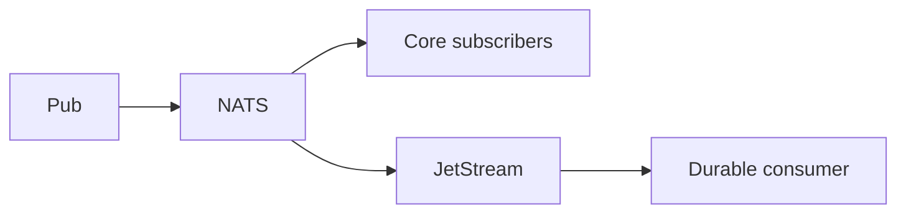

import { ConceptTemplate } from '@/features/kb/components/templates/ConceptTemplate'
import { Callout } from '@/features/kb/components/mdx/Callout'
import { ComparisonTable } from '@/features/kb/components/mdx/ComparisonTable'

export default function Layout({ children }) {
  return (
    <ConceptTemplate title="NATS">
      {children}
    </ConceptTemplate>
  )
}

**NATS** is a small, fast messaging system built around **subjects** (dotted names, wildcards). **Core NATS** is at-most-once: if a subscriber is missing, the message is gone. **JetStream** adds persistence, consumers, replay, and work queues.

## 1. Deep Dive and Mechanics

**Subjects.** shop.order.created. Wildcards: star for one token, greater-than for a tail. Servers route by subject trie.

**Queue groups.** Several subscribers share a group name; one of them gets each message. That is competing consumers on core NATS, still without persistence.

**JetStream.** Streams capture subjects to disk or memory. Consumers (push/pull, durable) have ack policies. Work-queue retention deletes a message once it is acked by the consumer.

**KV and Object store.** JetStream features on top of streams. Handy, not a replacement for Postgres.

<Callout icon="warning" title="Core NATS will drop your payment">
If you did not enable JetStream (or another durable log), a brief disconnect loses messages. Use core for signals, JetStream for work.
</Callout>

## 2. Mathematical / Theoretical Foundation

Core delivery is fire-and-forget multicast on a subject. JetStream is a log per stream with sequence numbers. Ack wait is a lease. R3 file storage is a replicated log with a Raft group per stream/consumer in modern versions.

<ComparisonTable
  headers={['Mode', 'Durable', 'Replay', 'Use']}
  rows={[
    ['Core pub-sub', 'No', 'No', 'Presence, cache bust'],
    ['Core queue group', 'No', 'No', 'Best-effort workers'],
    ['JetStream interest', 'Yes', 'Yes', 'Events'],
    ['JetStream work queue', 'Yes', 'Until ack', 'Jobs'],
  ]}
/>

## 3. Real-World Implementation

```python
# nc.publish("shop.order.created", payload)
# js.pull_subscribe("shop.order.created", durable="billing")
```

Set max-deliver and a DLQ subject. Watch pending acks.

## 4. Visualizations



## 5. Interview Prep

**Q: NATS versus Kafka?**
**A:** NATS is simpler ops and great for request/reply and light events. Kafka wins at huge retained logs, ecosystem, and multi-day replay for many groups.

**Q: Request/reply on NATS?**
**A:** Inbox subjects and a timeout. Fine for internal RPC. Do not confuse it with guaranteed async work.

**Q: How does clustering work?**
**A:** Core cluster gossips routes. JetStream uses Raft for the stream. Plan capacity for both.

## 6. Production Use Cases

- **Service mesh-adjacent** signaling and cache invalidation.
- **Edge / IoT** where a small binary matters.
- **JetStream jobs** when you do not want a full Kafka ops team.

<Callout icon="tip" title="Say core versus JetStream out loud">
Interviewers treat "we use NATS" as incomplete until you name durability.
</Callout>
