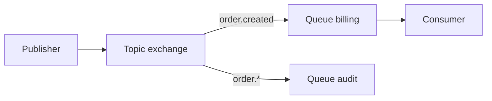

import { ConceptTemplate } from '@/features/kb/components/templates/ConceptTemplate'
import { Callout } from '@/features/kb/components/mdx/Callout'
import { ComparisonTable } from '@/features/kb/components/mdx/ComparisonTable'

export default function Layout({ children }) {
  return (
    <ConceptTemplate title="RabbitMQ">
      {children}
    </ConceptTemplate>
  )
}

**RabbitMQ** is a broker best known for **AMQP 0-9-1**. Producers publish to an **exchange**. The exchange **routes** to **queues** by type (direct, topic, fanout, headers). Consumers ack. Classic queues and **quorum queues** (Raft) are the modern durability story.

## 1. Deep Dive and Mechanics

**Exchanges.** Direct: exact routing key. Topic: dot wildcards. Fanout: all bound queues. You can change fan-out by adding a binding, not by changing publishers.

**Acks and prefetch.** prefetch (QoS) is the window of unacked messages. Manual ack after the side effect. Publisher confirms tell the producer the broker persisted.

**Quorum queues.** Replicated via Raft. Use these for durable work. Classic mirrored queues are legacy.

**Streams plugin.** A Kafka-like log on Rabbit for replay. Different from classic queues.

<Callout icon="warning" title="A full disk or memory alarm blocks publishers">
Rabbit will block connections when it hits high watermarks. That is backpressure. Alert on alarms, not only on queue depth.
</Callout>

## 2. Mathematical / Theoretical Foundation

Routing is a bind-time function from (exchange, key, headers) to queue set. Delivery is at-least-once with manual ack. Quorum commit waits for a Raft majority.

Prefetch N means up to N in-flight per consumer; crash cost is up to N redeliveries.

<ComparisonTable
  headers={['Piece', 'Role', 'Failure note']}
  rows={[
    ['Exchange', 'Route', 'Misbind = silent drop if no alternate'],
    ['Classic queue', 'Buffer', 'Node-local unless mirrored (legacy)'],
    ['Quorum queue', 'Raft buffer', 'Minority cannot commit'],
    ['Stream', 'Log', 'Consumers have offsets'],
  ]}
/>

## 3. Real-World Implementation

```python
# channel.exchange_declare(x, "topic", durable=True)
# channel.queue_bind(q, x, routing_key="order.#")
# channel.basic_consume(q, on_message, auto_ack=False)
```

Enable publisher confirms. Set a dead-letter exchange. Prefer quorum for anything you would page on.

## 4. Visualizations



## 5. Interview Prep

**Q: What if no queue is bound?**
**A:** The message is dropped unless you set an alternate exchange or mandatory flag plus return. Silent drop is a common production bug.

**Q: Rabbit versus Kafka?**
**A:** Flexible routing and work queues versus long logs and replay. Many companies use Rabbit for commands and Kafka for facts.

**Q: How do you scale consumers?**
**A:** Add consumers on the same queue. For very high rates, shard routing keys into several queues. One giant classic queue is a single-node bottleneck.

## 6. Production Use Cases

- **Task queues** for web apps (often via Celery historically).
- **Topic routing** of domain events to teams.
- **Federation / shovel** across sites.

<Callout icon="tip" title="Use quorum queues by default">
If the interview stops at "durable classic queue," mention Raft quorum queues. That is the current advice.
</Callout>
