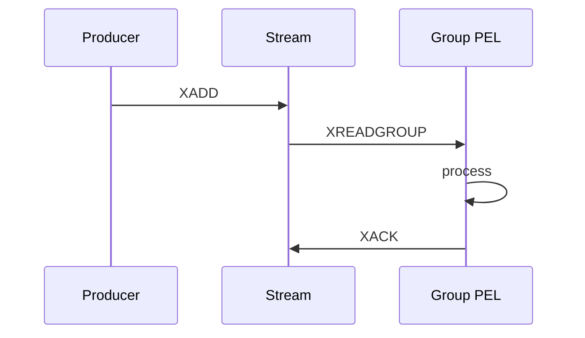

import { ConceptTemplate } from '@/features/kb/components/templates/ConceptTemplate'
import { Callout } from '@/features/kb/components/mdx/Callout'
import { ComparisonTable } from '@/features/kb/components/mdx/ComparisonTable'

export default function Layout({ children }) {
  return (
    <ConceptTemplate title="Redis Streams">
      {children}
    </ConceptTemplate>
  )
}

**Redis Streams** (XADD, XREADGROUP, XACK) are an append-only log inside Redis. Entries have ids (time-seq). **Consumer groups** share the stream like a Kafka group, with a **pending entries list** (PEL) for unacked messages.

## 1. Deep Dive and Mechanics

**XADD.** Append with optional MAXLEN ~ to cap memory. Redis is memory-first; an unbounded stream is an OOM.

**Groups.** XGROUP CREATE. XREADGROUP delivers new entries and tracks them in the PEL until XACK. Crashed consumers leave PEL items; XCLAIM or XAUTOCLAIM steals them after a min idle time.

**Versus Kafka.** No multi-week cheap disk log, no multi-AZ ISR story unless you build it with Redis replication/Cluster. Excellent for modest rates next to a cache.

**Versus Redis pub/sub.** Pub/sub is fire-and-forget. Streams persist (until trimmed).

<Callout icon="warning" title="MAXLEN is not a warehouse">
Approximate trim drops old entries. If you need audit, ship out to S3 or Kafka.
</Callout>

## 2. Mathematical / Theoretical Foundation

A stream is a radix-tree of ids. Group lag is last-id minus last-delivered. PEL size is in-flight risk: crash cost equals PEL entries for that consumer.

Replication is Redis async by default (PACELC EL). A failover can lose the tail of the stream.

<ComparisonTable
  headers={['Redis feature', 'Durable log', 'Groups', 'Use']}
  rows={[
    ['Pub/Sub', 'No', 'No', 'Live signals'],
    ['Lists / BRPOP', 'Yes', 'No (steal risk)', 'Simple queues'],
    ['Streams', 'Yes until trim', 'Yes', 'Jobs + light events'],
    ['Kafka', 'Disk retention', 'Yes', 'Platform backbone'],
  ]}
/>

## 3. Real-World Implementation

```python
# r.xadd("orders", {"json": body}, maxlen=100000, approximate=True)
# r.xreadgroup("cg", "w1", streams={"orders": ">"}, count=10)
# r.xack("orders", "cg", msg_id)
```

AClaim idle pending after a timeout. Monitor PEL length.

## 4. Visualizations



## 5. Interview Prep

**Q: When do you pick Streams over SQS or Kafka?**
**A:** You already operate Redis, volume fits in memory plus trim, and you want one fewer vendor. Not for company-wide event history.

**Q: What is the PEL?**
**A:** The list of delivered-but-unacked ids. It is how Redis knows what to redeliver. If you never XACK, the PEL grows until Redis hurts.

**Q: At-least-once?**
**A:** Yes. XACK after the DB write. Same idempotency story as SQS.

## 6. Production Use Cases

- **Per-service job lists** next to cache.
- **Light fan-in** of device events before a flush to a lake.
- **Notifications** that must survive a brief subscriber restart.

<Callout icon="tip" title="Cap the stream and page on PEL">
Those two metrics decide whether Redis Streams stays boring.
</Callout>
