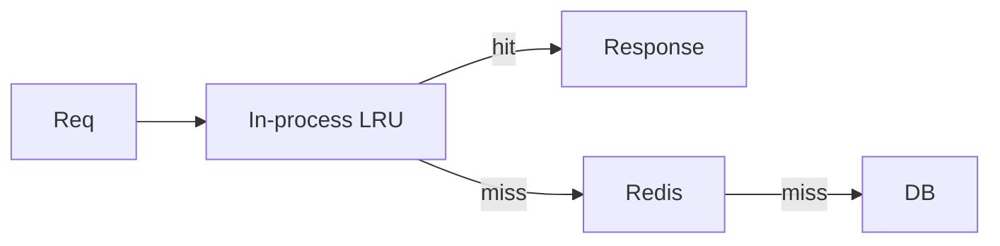

import { ConceptTemplate } from '@/features/kb/components/templates/ConceptTemplate'
import { Callout } from '@/features/kb/components/mdx/Callout'
import { ComparisonTable } from '@/features/kb/components/mdx/ComparisonTable'

export default function Layout({ children }) {
  return (
    <ConceptTemplate title="Application Caching">
      {children}
    </ConceptTemplate>
  )
}

**Application caching** stores hot data in the app process (or a sidecar the app owns) so the next request does not leave the machine. Hits are microseconds. The cost is **per-instance copies** and **invalidation that does not fan out** unless you build it.

## 1. Deep Dive and Mechanics

**In-process maps.** A concurrent hash map with TTL. Zero network. Lost on deploy. Each replica has its own view. Feature flags and tiny config love this. User-specific data can explode memory.

**Local LRU libraries.** Caffeine, Guava, lru_cache. Size bounds matter more than you think; a cache without eviction is a leak.

**Sidecar / node-local Redis.** Still "application tier" if only that node talks to it. Helps multi-process hosts (PHP, workers) share one local cache.

**Stampede.** When the local entry expires, every in-flight request on that instance may reload. Single-flight (one loader, others wait) is the fix in-process.

<Callout icon="warning" title="Local cache plus sticky sessions is not a consistency model">
User A updates a name on instance 3. Instance 7 still has the old name until TTL. If that is wrong for the product, you need a shared cache or explicit invalidation.
</Callout>

## 2. Mathematical / Theoretical Foundation

Hit latency is L1/L2 plus a lock. Miss cost is the backing store. Effective capacity is size times instance count, but uniqueness is not: the same key is stored N times.

Invalidation delay is max(TTL, time to receive a bust message). Without a bus, it is just TTL.

<ComparisonTable
  headers={['Layer', 'Latency', 'Shared', 'Invalidate']}
  rows={[
    ['In-process', 'Lowest', 'No', 'TTL or restart'],
    ['Node Redis', 'Low', 'Per node', 'Local only'],
    ['Cluster Redis', 'Network', 'Yes', 'Del or pubsub'],
    ['CDN', 'Geo', 'Users', 'Purge API'],
  ]}
/>

## 3. Real-World Implementation

```python
from functools import lru_cache

@lru_cache(maxsize=4096)
def sku_name(sku_id):
    return db.get_sku(sku_id).name
```

Add a TTL wrapper. Flush on deploy if the process cache can be wrong in a dangerous way (authz).

## 4. Visualizations



## 5. Interview Prep

**Q: Why not cache everything in-process?**
**A:** Memory, staleness across replicas, and GC. Huge heaps make pauses. Shared Redis is the usual next step.

**Q: How do you bust N instances?**
**A:** Pub-sub (Redis, NATS) or version the key and accept TTL. Do not SSH to every box.

**Q: Request-scoped cache?**
**A:** A map that lives for one request (DataLoader style). Dedupes duplicate keys in one GraphQL query. It is not cross-request.

## 6. Production Use Cases

- **Config and feature flags** with short TTL.
- **ORM identity maps** per request.
- **Hot translations** or SKU names on a storefront node.

<Callout icon="tip" title="Bound size and TTL on day one">
An unbounded process cache will take the JVM down on the first traffic spike.
</Callout>
