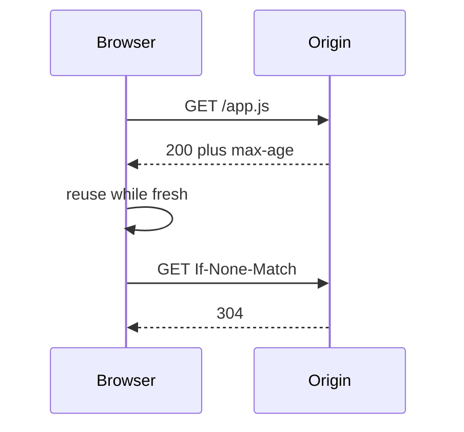

import { ConceptTemplate } from '@/features/kb/components/templates/ConceptTemplate'
import { Callout } from '@/features/kb/components/mdx/Callout'
import { ComparisonTable } from '@/features/kb/components/mdx/ComparisonTable'

export default function Layout({ children }) {
  return (
    <ConceptTemplate title="Browser Caching">
      {children}
    </ConceptTemplate>
  )
}

**Browser caching** is the HTTP cache in the user's agent (and sometimes a shared proxy). You control it with **Cache-Control**, **ETag**, **Last-Modified**, and **Vary**. A correct policy makes repeat visits cheap. A wrong policy serves a stale app.js forever or disables caching you already paid for.

## 1. Deep Dive and Mechanics

**Freshness.** max-age and s-maxage set seconds of freshness. During that window the browser may not revalidate. After it, a conditional request (If-None-Match) can get 304.

**Validators.** ETag is a version token. Last-Modified is a date. Prefer ETag for APIs.

**private versus public.** private is browser-only (user-specific). public may be stored by CDNs. Never mark personalized HTML public.

**immutable plus hashed names.** app.9f3c.js with long max-age and immutable. HTML stays short-lived so it can point at new hashes.

<Callout icon="warning" title="Cache-Control on APIs is a product decision">
A private user JSON with max-age=86400 will show yesterday's cart. Default APIs to no-store unless you designed the freshness.
</Callout>

## 2. Mathematical / Theoretical Foundation

Freshness lifetime is an explicit number of seconds from response time (or heuristic if you send only Last-Modified — avoid heuristics). Revalidation cost is a conditional GET; payload cost is zero on 304.

Vary: Cookie turns the cache key into a per-user explosion. That is how you accidentally disable a CDN.

<ComparisonTable
  headers={['Directive', 'Who stores', 'Revalidate']}
  rows={[
    ['no-store', 'Nobody', 'Always network'],
    ['no-cache', 'May store', 'Must revalidate'],
    ['max-age=N', 'Browser', 'After N seconds'],
    ['s-maxage=N', 'Shared / CDN', 'After N seconds'],
  ]}
/>

## 3. Real-World Implementation

```http
Cache-Control: public, max-age=31536000, immutable
ETag: "9f3c"
```

HTML: no-cache or a short max-age. Assets: hashed name plus immutable.

## 4. Visualizations



## 5. Interview Prep

**Q: no-cache versus no-store?**
**A:** no-cache means store but revalidate. no-store means do not write to disk. Auth pages want no-store.

**Q: How do you ship a new frontend?**
**A:** Content-hash filenames, long cache on assets, short cache on HTML. A unique query string works but is messier.

**Q: Why is my CDN not caching?**
**A:** Set-Cookie, Vary: Cookie, Authorization, or Cache-Control: private. Check the response, not the Terraform.

## 6. Production Use Cases

- **Static SPAs** with hashed bundles.
- **Profile avatars** with ETag.
- **Avoid** caching bank balances in the browser.

<Callout icon="tip" title="Treat HTML as the pointer">
If HTML is cached for a week, users cannot see new JS hashes. That is the stuck-old-app incident.
</Callout>
