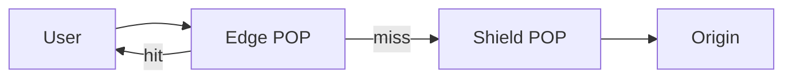

import { ConceptTemplate } from '@/features/kb/components/templates/ConceptTemplate'
import { Callout } from '@/features/kb/components/mdx/Callout'
import { ComparisonTable } from '@/features/kb/components/mdx/ComparisonTable'

export default function Layout({ children }) {
  return (
    <ConceptTemplate title="CDN Caching">
      {children}
    </ConceptTemplate>
  )
}

A **CDN cache** stores origin responses at **points of presence** close to users. The first request (or a miss) goes to origin. Later requests for the same **cache key** are served from the edge. This is how static sites and many APIs survive launches.

## 1. Deep Dive and Mechanics

**Cache key.** Usually scheme, host, path, and selected query params. Cookies and Authorization often force a miss. Normalize the key or you shard the cache into dust.

**TTL and stale.** s-maxage drives shared caches. stale-while-revalidate serves old bytes while one request refreshes. stale-if-error serves old bytes when origin is down.

**Purge / invalidate.** By URL, tag, or wildcard. Purge is eventual across POPs. Design so a late purge is safe (versioned URLs).

**Shielding.** One POP talks to origin so a global miss storm becomes one origin request per object.

<Callout icon="warning" title="A cache key that includes a session cookie is a miss factory">
Every user gets a unique object. You paid for a CDN and still melt origin. Strip cookies on static paths.
</Callout>

## 2. Mathematical / Theoretical Foundation

Hit ratio H. Origin QPS is roughly (1-H) times edge QPS plus revalidations. A drop of H from 0.99 to 0.90 is a 10x origin increase.

Purge latency is a gossip or push across POPs; treat it as seconds to minutes, not zero.

<ComparisonTable
  headers={['Object', 'CDN fit', 'Key advice']}
  rows={[
    ['Hashed JS/CSS', 'Perfect', 'Long TTL, ignore cookies'],
    ['Product images', 'Great', 'Version in path'],
    ['HTML shell', 'Short TTL', 'Purge or short max-age'],
    ['Personalized API', 'Usually no', 'private, no-store'],
  ]}
/>

## 3. Real-World Implementation

```text
Cache-Control: public, s-maxage=86400, stale-while-revalidate=60
Surrogate-Key: product-42
```

Purge tag product-42 on edit. Cloudflare, Fastly, CloudFront, and Akamai differ in tag names; the idea is the same.

## 4. Visualizations



## 5. Interview Prep

**Q: How do you handle a bad file at the edge?**
**A:** Versioned URL (best) or purge. If you cannot purge fast, shorten TTL next time.

**Q: Origin shield versus more origin replicas?**
**A:** Shield cuts duplicate misses. Replicas help when the miss traffic is still large or regional.

**Q: Can the CDN cache POST?**
**A:** Generally no, and you should not want it. GET/HEAD with explicit Cache-Control.

## 6. Production Use Cases

- **Static sites** and image delivery.
- **API GET** catalogs with tagged purge.
- **Video segments** with long TTL.

<Callout icon="tip" title="Draw the cache key on the whiteboard">
Most CDN outages are key mistakes, not POP outages.
</Callout>
