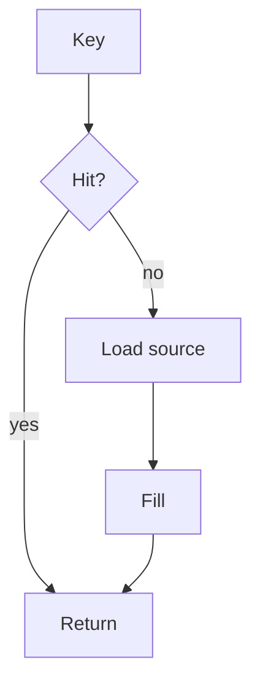

import { ConceptTemplate } from '@/features/kb/components/templates/ConceptTemplate'
import { Callout } from '@/features/kb/components/mdx/Callout'
import { ComparisonTable } from '@/features/kb/components/mdx/ComparisonTable'

export default function Layout({ children }) {
  return (
    <ConceptTemplate title="Cache Fundamentals">
      {children}
    </ConceptTemplate>
  )
}

A **cache** is a small, fast store that remembers the result of a slower lookup. A **hit** returns the remembered value. A **miss** loads from the source of truth, then **fills** the cache. When full, an **eviction policy** drops something. When data changes, **invalidation** or **TTL** stops you from serving a lie forever.

## 1. Deep Dive and Mechanics

**Locality.** Caches work because of temporal locality (the same key again) and spatial locality (nearby keys). Random unique keys have a hit ratio near zero.

**Layers.** Browser, CDN, app process, Redis, database buffer pool. Each has a different key space and failure mode. A miss at one layer can still hit another.

**Correctness.** The hard part is not the hash map. It is who may see stale data, and for how long. Name the SLA in seconds, not "we cache it."

**Stampede, thundering herd, dogpile.** Many misses for one expired key. Prevent with locks, jittered TTL, or stale-while-revalidate.

<Callout icon="info" title="A cache is a performance optimization until it is a consistency bug">
If the business cannot name an acceptable staleness, do not cache that key.
</Callout>

## 2. Mathematical / Theoretical Foundation

Hit ratio H, miss penalty M, hit time C. Mean time is H times C plus (1-H) times M. Capacity versus working set: if the working set does not fit, H collapses (thrash).

Little's law still applies to in-flight fills. Too many parallel fills can DDoS the database you meant to protect.

<ComparisonTable
  headers={['Idea', 'Means', 'Knob']}
  rows={[
    ['Hit ratio', 'Fraction served from cache', 'Key design, size'],
    ['TTL', 'Max staleness', 'Seconds'],
    ['Eviction', 'What drops when full', 'LRU, LFU, TTL'],
    ['Invalidation', 'Drop on write', 'Pub-sub, delete key'],
  ]}
/>

## 3. Real-World Implementation

```python
def get(cache, key, load):
    hit = cache.get(key)
    if hit is not None:
        return hit
    val = load(key)
    cache.set(key, val)
    return val
```

This is cache-aside. Add TTL and single-flight before production.

## 4. Visualizations



## 5. Interview Prep

**Q: What do you cache?**
**A:** Read-heavy, stable or TTL-tolerant keys with a small working set relative to RAM. Not a unique write-once audit row.

**Q: How do you know it works?**
**A:** Hit ratio, p99 of the path, origin QPS, and error rate on fill. A high hit ratio with stale authz is a failure.

**Q: Cache versus buffer pool?**
**A:** The DB already caches pages. An app cache is for computed results and to cut parse/network, not a replacement for indexes.

## 6. Production Use Cases

- **Session and feature flags**.
- **Product catalog** pages.
- **Idempotency** lookup tables (with care).

<Callout icon="tip" title="State working set and staleness">
Those two numbers tell you if Redis is the right size and if the product will accept the cache.
</Callout>
