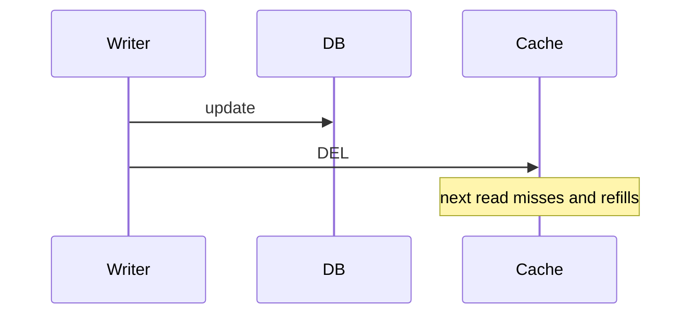

import { ConceptTemplate } from '@/features/kb/components/templates/ConceptTemplate'
import { Callout } from '@/features/kb/components/mdx/Callout'
import { ComparisonTable } from '@/features/kb/components/mdx/ComparisonTable'

export default function Layout({ children }) {
  return (
    <ConceptTemplate title="Cache Invalidation">
      {children}
    </ConceptTemplate>
  )
}

**Cache invalidation** is how you stop serving a value after the source of truth changed. The three honest methods are **delete the key on write**, **change the key** (version or hash), and **wait for TTL**. Mixing them without a rule is how you get zombies.

## 1. Deep Dive and Mechanics

**Write-through delete.** After a successful DB write, DEL the cache key (or SET the new value). If DEL fails, you are stale until TTL. Retry DEL; do not ignore errors.

**Versioned keys.** user:42:v7. The write bumps v in the DB or a generation number. Old keys rot via TTL. Readers learn the generation first (small, hot key).

**Event-driven bust.** Publish user.updated; many cache nodes delete. At-least-once events mean extra DELs (fine). Lost events mean TTL is the backstop.

**CDC.** Invalidate from the WAL so you do not forget a write path. Best when many services write the table.

<Callout icon="warning" title="Invalidate-then-write races a concurrent reader">
A reader can miss, load the old row, and fill the cache after your delete. Prefer write-then-delete, or fill with a version check.
</Callout>

## 2. Mathematical / Theoretical Foundation

If invalidation is unreliable with probability p per write and TTL is T, expected stale time is about p times T for that write. Make p small (retries) and T an upper bound you can defend.

Generation numbers are a monotonic epoch: readers ignore values tagged with a smaller epoch.

<ComparisonTable
  headers={['Method', 'Stale window', 'Cost', 'Risk']}
  rows={[
    ['TTL only', 'Up to T', 'None on write', 'Long lie'],
    ['DEL on write', 'Race + DEL fail', 'Extra write path', 'Forgotten writers'],
    ['Versioned key', 'Until readers see gen', 'Indirection', 'Gen hot key'],
    ['CDC bust', 'Replication lag', 'Pipeline', 'Lag spikes'],
  ]}
/>

## 3. Real-World Implementation

```python
def update_user(db, cache, user):
    db.save(user)
    cache.delete(f"user:{user.id}")
```

Use the same key function on read and write. A typo is a permanent stale.

## 4. Visualizations



## 5. Interview Prep

**Q: Why is invalidation hard?**
**A:** Multiple writers, races with fills, partial failure of DEL, and key-space drift. Phil Karlton's joke is about this, not about hash maps.

**Q: Delete or overwrite?**
**A:** Overwrite (set) if you have the new value and want a warm cache. Delete if other fields are computed and you are not sure you have the full object.

**Q: How do you invalidate a list?**
**A:** Lists are painful. Version the list, cache fragments, or do not cache the list. Purging "all search pages" wants a CDN tag, not a million DELs.

## 6. Production Use Cases

- **Profile updates** that must show on the next page load.
- **Price changes** with a short TTL backstop.
- **CDN purge tags** for HTML that embeds the data.

<Callout icon="tip" title="TTL is the safety net, not the plan">
Say the write-path delete first, then the TTL that saves you when that path misses a code branch.
</Callout>
