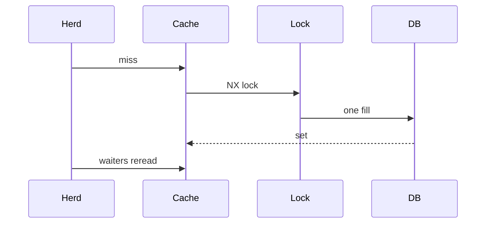

import { ConceptTemplate } from '@/features/kb/components/templates/ConceptTemplate'
import { Callout } from '@/features/kb/components/mdx/Callout'
import { ComparisonTable } from '@/features/kb/components/mdx/ComparisonTable'

export default function Layout({ children }) {
  return (
    <ConceptTemplate title="Cache Stampede Prevention">
      {children}
    </ConceptTemplate>
  )
}

A **cache stampede** (dogpile, thundering herd) is many concurrent misses for the same key after expiry or eviction. Every request hits the database. The database falls over, fills fail, and the cache stays empty. Prevention means **one fill** (or a few) and everyone else **waits or sees stale**.

## 1. Deep Dive and Mechanics

**Single-flight / request coalescing.** In-process, one goroutine loads; waiters share the result. Works per instance, not cluster-wide.

**Distributed lock.** SET key:lock NX PX 2000 around the fill. Losers wait and reread the cache, or serve stale. Lock expiry must exceed fill time.

**Probabilistic early expiration.** XFetch / jitter: some requests refresh before TTL hits zero so expiry is smeared.

**Stale-while-revalidate.** Keep serving the old value past TTL while a background refresh runs. Users see slightly old data; origin sees one load.

<Callout icon="error" title="A herd can take the site down in seconds">
Hot keys (home page, a celebrity profile) are the usual victims. Test expiry under load, not only the happy hit path.
</Callout>

## 2. Mathematical / Theoretical Foundation

If R requests arrive during a fill of duration F, an unprotected cache issues R origin queries. With a lock, origin queries drop to about 1 plus stragglers. Jittered TTLs turn a Dirac expiry at t into a window of width J.

<ComparisonTable
  headers={['Tactic', 'Scope', 'User sees', 'Ops note']}
  rows={[
    ['Single-flight', 'Process', 'Wait', 'Easy, incomplete'],
    ['NX lock', 'Cluster', 'Wait or stale', 'Need TTL on lock'],
    ['Jittered TTL', 'Cluster', 'Mostly hits', 'Smear only'],
    ['Serve stale', 'Cluster', 'Old value', 'Best UX often'],
  ]}
/>

## 3. Real-World Implementation

```python
def get_hot(cache, key, load):
    val, stale = cache.get_with_ttl(key)
    if val is not None and not stale:
        return val
    if cache.set(key + ":lock", "1", nx=True, px=2000):
        try:
            fresh = load()
            cache.set(key, fresh)
            return fresh
        finally:
            cache.delete(key + ":lock")
    return val if val is not None else load()
```

The last load() is the fallback if there is no stale value. Keep it rare.

## 4. Visualizations



## 5. Interview Prep

**Q: Why not just a longer TTL?**
**A:** That reduces stampede frequency, not severity, and increases staleness. Still add a lock or stale serve for hot keys.

**Q: What if the locker dies?**
**A:** Lock TTL releases it. Waiters may stampede once. That is better than a stuck lock that never fills.

**Q: Redis versus in-process single-flight?**
**A:** Use both. In-process cuts local herds. Redis lock cuts cross-instance herds.

## 6. Production Use Cases

- **Homepage assemblies**.
- **Token validation** dumps.
- **CDN** stale-while-revalidate at the edge.

<Callout icon="tip" title="Name the hottest ten keys">
Stampede work is wasted on the long tail. Instrument miss rate per key.
</Callout>
