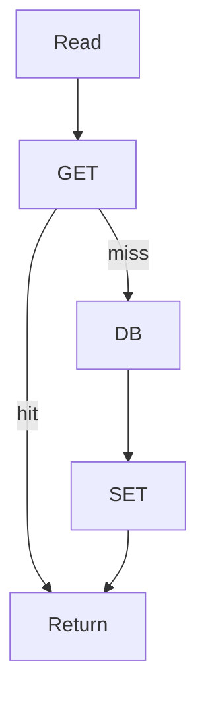

import { ConceptTemplate } from '@/features/kb/components/templates/ConceptTemplate'
import { Callout } from '@/features/kb/components/mdx/Callout'
import { ComparisonTable } from '@/features/kb/components/mdx/ComparisonTable'

export default function Layout({ children }) {
  return (
    <ConceptTemplate title="Cache-Aside (Lazy Loading)">
      {children}
    </ConceptTemplate>
  )
}

**Cache-aside** (lazy load) puts the application in charge. Read: GET cache; on miss, read the database; SET cache. Write: write the database, then delete (or update) the cache. The cache never calls the database by itself.

## 1. Deep Dive and Mechanics

**Why it is popular.** The app already knows the key and the query. Redis stays dumb. You can cache computed objects, not just rows.

**Miss path.** Must be idempotent and stampede-safe for hot keys. A naive aside is the stampede.

**Write path.** If you only implement the read side, the cache is stale until TTL. The delete-after-write is part of the pattern, not an extra.

**Negative caching.** Cache "not found" for a short time so missing keys do not beat the DB. Watch the create path: you must evict the negative entry.

<Callout icon="info" title="Aside is not read-through">
Read-through: the cache library loads on miss. Aside: your code loads. Same idea, different who-owns-the-query.
</Callout>

## 2. Mathematical / Theoretical Foundation

Expected latency is H times cache plus (1-H) times (cache + DB + set). Write amplification is one extra DEL. Consistency is TTL plus delete success.

Race: read miss, concurrent write, then SET of old value. Mitigate with versions or short TTL.

<ComparisonTable
  headers={['Pattern', 'Who fills', 'Write behavior', 'Stale risk']}
  rows={[
    ['Cache-aside', 'App on miss', 'App DELs', 'Race + missed DEL'],
    ['Read-through', 'Cache loader', 'Often DEL', 'Same races'],
    ['Write-through', 'On write', 'Sync set plus DB', 'Write latency'],
    ['Write-behind', 'On write to cache', 'Async DB', 'Loss on crash'],
  ]}
/>

## 3. Real-World Implementation

```python
def get_user(cache, db, user_id):
    key = f"user:{user_id}"
    cached = cache.get(key)
    if cached is not None:
        return cached
    user = db.get(user_id)
    if user is not None:
        cache.set(key, user, ttl=60)
    return user
```

Pair with delete on update. Use a version field if the race matters.

## 4. Visualizations



## 5. Interview Prep

**Q: Why not write-through everywhere?**
**A:** Aside avoids caching writes that are never read and keeps Redis out of the write latency path. Write-through is better when the next read is immediate and must be fresh.

**Q: What do you store?**
**A:** A serialized DTO, not a live ORM object. Include a schema version.

**Q: How long is TTL?**
**A:** As short as the product allows if invalidation can fail; as long as the working set needs to keep H high. Pick with numbers.

## 6. Production Use Cases

- **Default Redis + SQL** stack.
- **Session blobs** with explicit delete on logout.
- **Computed recommendations** with a short TTL.

<Callout icon="tip" title="Implement read and write in the same PR">
A cache-aside read without a write-side delete is just a TTL cache with a fancy name.
</Callout>
