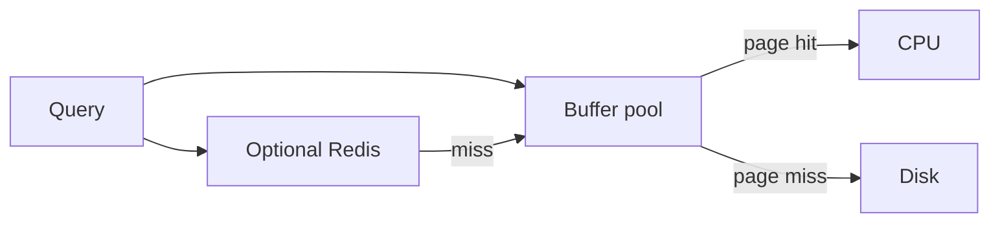

import { ConceptTemplate } from '@/features/kb/components/templates/ConceptTemplate'
import { Callout } from '@/features/kb/components/mdx/Callout'
import { ComparisonTable } from '@/features/kb/components/mdx/ComparisonTable'

export default function Layout({ children }) {
  return (
    <ConceptTemplate title="Database Cache">
      {children}
    </ConceptTemplate>
  )
}

**Database cache** means the engine's own caches: **buffer pool** (pages), **plan cache**, and optional **result cache**, plus objects you add next to the DB (**materialized views**, Redis of query results). Before you add Redis, know what Postgres or MySQL already keeps in RAM.

## 1. Deep Dive and Mechanics

**Buffer pool.** Disk pages stay in memory. A well-tuned pool makes "the DB is the cache" true for the working set. Random huge scans evict useful pages (cache stampede at the page layer).

**Result / query cache.** MySQL's old query cache is gone for good reasons (invalidation on any table write). Do not turn on folklore settings.

**Materialized views.** Stored results, refreshed on a schedule or on trigger. Great for dashboards. Stale by definition between refreshes.

**External query cache.** Redis of SELECT output. Same invalidation problems as cache-aside, plus huge keys if you cache wide rows.

<Callout icon="info" title="An index is not a cache">
Indexes make the miss path fast. They do not replace a pool that is too small for the working set.
</Callout>

## 2. Mathematical / Theoretical Foundation

Buffer hit ratio is pages served from RAM. If the working set W is larger than the pool P, hit ratio is roughly P/W for uniform access, better with skew.

Materialized view freshness is the refresh period T. Queries are wrong by up to T plus run time.

<ComparisonTable
  headers={['Layer', 'Unit', 'Invalidate']}
  rows={[
    ['Buffer pool', 'Page', 'Write to page'],
    ['Materialized view', 'Result set', 'Refresh'],
    ['Redis of SQL', 'Object', 'Your code'],
    ['CDN of GET', 'HTTP body', 'TTL / purge'],
  ]}
/>

## 3. Real-World Implementation

```sql
-- Postgres: watch heap hits versus reads
-- shared_buffers sized for the hot working set
```

Measure cache_hit from pg_stat_database before buying Redis for the same rows.

## 4. Visualizations



## 5. Interview Prep

**Q: Should we cache SQL in Redis?**
**A:** If the query is expensive beyond page IO (joins, fan-out, serialization) or you want to shield the DB from app storms. If the pool already hits 99 percent, Redis may only add a consistency bug.

**Q: Why did the buffer pool miss spike?**
**A:** A new scan, a backup, or a working set that grew past RAM. Look at the query, not only at adding nodes.

**Q: Replica as a cache?**
**A:** A replica is a stale copy with a lag number. Good for read scale. Not a linearizable cache.

## 6. Production Use Cases

- **OLTP** sized so the hot pages fit in RAM.
- **Warehouse** result tables / MVs for BI.
- **Redis** for computed aggregates the DB would redo per request.

<Callout icon="tip" title="Quote the buffer hit ratio in the design">
It shows you understand the first cache, not only the trendy one.
</Callout>
