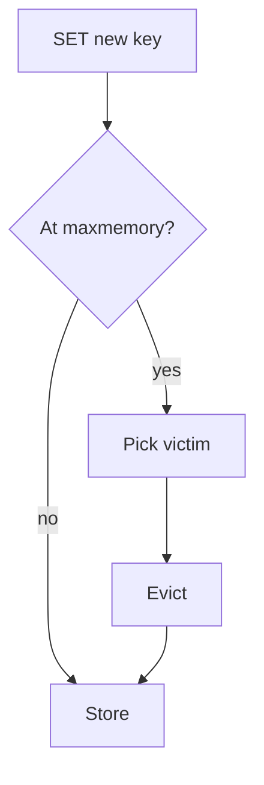

import { ConceptTemplate } from '@/features/kb/components/templates/ConceptTemplate'
import { Callout } from '@/features/kb/components/mdx/Callout'
import { ComparisonTable } from '@/features/kb/components/mdx/ComparisonTable'

export default function Layout({ children }) {
  return (
    <ConceptTemplate title="Cache Eviction Policies">
      {children}
    </ConceptTemplate>
  )
}

An **eviction policy** picks the victim when the cache is at capacity. **LRU** drops the least recently used. **LFU** drops the least frequent. **FIFO** drops the oldest insert. **Random** is cheap. **TTL** drops expired entries even before capacity pressure. The right policy matches the access distribution.

## 1. Deep Dive and Mechanics

**LRU.** Scan-resistant? Classic LRU is not: a single full scan evicts the working set. Redis approximated LRU. Caffeine uses W-TinyLFU to resist scans.

**LFU.** Good for stable popularity (a catalog). Slow to admit a new hot key if counts are stale. Aging counters fix that.

**TTL as eviction.** Expiry is correctness (staleness bound) and capacity (natural drain). Do not rely on TTL alone to keep size down if keys refresh.

**Victim + sample.** Redis samples a few keys and evicts the best candidate. Exact LRU is too expensive at millions of keys.

<Callout icon="warning" title="A scan can flush an LRU">
A reporting query that walks every key through the cache layer will evict the homepage. Separate caches or use an admission policy.
</Callout>

## 2. Mathematical / Theoretical Foundation

Under Zipf access, a small cache captures a large hit fraction (heavy head). LRU is competitive for some sequences; there are adversarial sequences where LRU fails (Belady). Belady's MIN (evict the farthest next use) is optimal offline and not implementable online.

<ComparisonTable
  headers={['Policy', 'Drops', 'Good for', 'Weak against']}
  rows={[
    ['LRU', 'Cold recency', 'Temporal locality', 'Scans'],
    ['LFU', 'Unpopular', 'Stable Zipf', 'Shift in popularity'],
    ['FIFO', 'Oldest insert', 'Simple', 'Hot old keys'],
    ['TTL', 'Expired', 'Staleness bound', 'Size if refreshed'],
    ['Random', 'Anything', 'Cheap', 'Unlucky hot keys'],
  ]}
/>

## 3. Real-World Implementation

```text
# Redis maxmemory-policy
allkeys-lru
volatile-ttl
allkeys-lfu
```

volatile-* only evicts keys that have an expire. If you forgot TTL, the cache will hit maxmemory and start failing writes.

## 4. Visualizations



## 5. Interview Prep

**Q: LRU versus LFU for a news site?**
**A:** News shifts: LRU or TinyLFU with aging. Pure LFU keeps yesterday's viral story too long and admits today's slowly.

**Q: What is scan resistance?**
**A:** Not letting a one-time sequential read evict the hot set. Windowed / admission filters (TinyLFU) help.

**Q: Why did Redis start rejecting writes?**
**A:** maxmemory hit and policy is noeviction, or only volatile keys exist and none have TTLs. Check the policy.

## 6. Production Use Cases

- **Redis maxmemory-policy** in every cluster that is not a pure store.
- **CDN** LRU at the POP.
- **CPU caches** (hardware LRU approximations) as the metaphor.

<Callout icon="tip" title="Pair eviction with a size budget">
A policy without maxmemory is not a policy. It is a leak.
</Callout>
