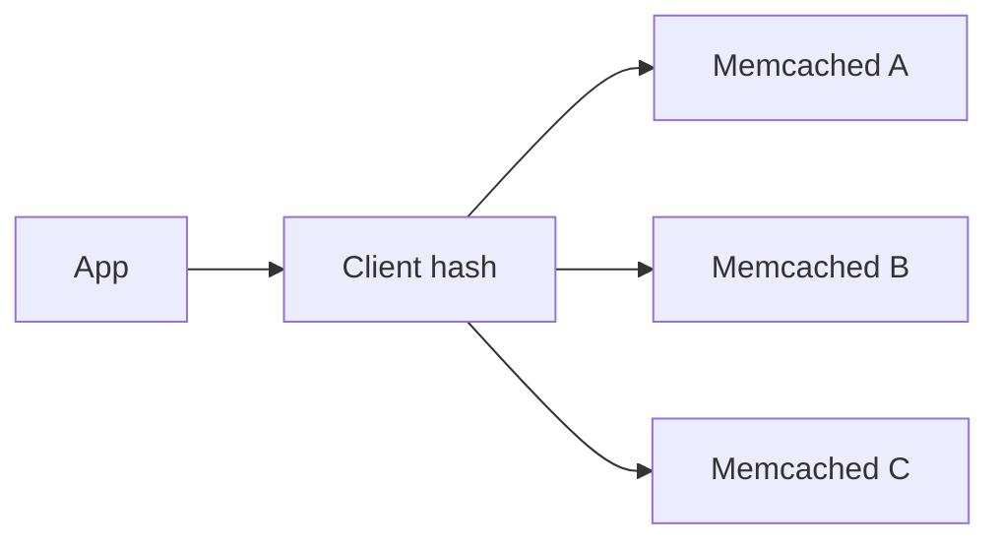

import { ConceptTemplate } from '@/features/kb/components/templates/ConceptTemplate'
import { Callout } from '@/features/kb/components/mdx/Callout'
import { ComparisonTable } from '@/features/kb/components/mdx/ComparisonTable'

export default function Layout({ children }) {
  return (
    <ConceptTemplate title="Memcached">
      {children}
    </ConceptTemplate>
  )
}

**Memcached** is an in-memory key-value cache. It speaks a simple protocol, stores bytes, and **forgets on restart**. Clustering is client-side consistent hashing. There are no lists, streams, or Lua. That simplicity is why it still wins as a **pure cache**.

## 1. Deep Dive and Mechanics

**Slabs.** Memory is carved into fixed-size classes. An item goes to the smallest slab that fits. Waste (internal fragmentation) happens when values sit just over a class size. LRU is per slab, not global — a surprising eviction story.

**No persistence.** Restart = empty. That is a feature for a cache. Do not put sessions you cannot rebuild in Memcached unless you accept a logout storm.

**Client sharding.** The client maps keys to nodes. Add a node and you lose a slice of keys (consistent hashing reduces but does not zero that). mcrouter and similar proxies help.

**Multithreading.** Memcached scales on many cores for GET/SET. Fine for high QPS simple values.

<Callout icon="info" title="Memcached is not a database">
If you need replication, persistence, or a counter that must not reset, you wanted Redis or SQL. Use Memcached to drop load.
</Callout>

## 2. Mathematical / Theoretical Foundation

Hit ratio depends on per-slab LRU. A slab class that is too hot evicts inside that class while another class sits idle. Slab auto-reassign (newer versions) tries to move memory.

Consistent hashing: adding 1 of N nodes remaps about 1/N of keys.

<ComparisonTable
  headers={['', 'Memcached', 'Redis as cache']}
  rows={[
    ['Data types', 'Bytes', 'Many'],
    ['Persistence', 'No', 'Optional'],
    ['Eviction', 'Slab LRU', 'Configurable'],
    ['Ops surface', 'Tiny', 'Large'],
  ]}
/>

## 3. Real-World Implementation

```python
# client.set("user:42", blob, expire=60)
# client.get("user:42")
```

Cap value size. Compress large JSON. Do not store 1 MB objects if you can avoid it (slab pain, network).

## 4. Visualizations



## 5. Interview Prep

**Q: Why Memcached over Redis?**
**A:** You want a cache that cannot be mistaken for a store, you need simple high-QPS GET/SET, and you like slab simplicity. Facebook-scale lore is Memcached.

**Q: What is a slab eviction surprise?**
**A:** Keys of size 80 bytes evict each other even if there is free RAM in another slab class. Watch slab stats.

**Q: How do you warm after restart?**
**A:** You do not, mostly. Accept a miss storm or pre-warm critical keys. This is why stampede control matters.

## 6. Production Use Cases

- **HTML fragment** caches.
- **ORM** second-level cache.
- **Sidecar** next to a stateless fleet.

<Callout icon="tip" title="Keep values small and TTLs honest">
Memcached rewards boring blobs. The moment you need a lock or a list, switch tools.
</Callout>
