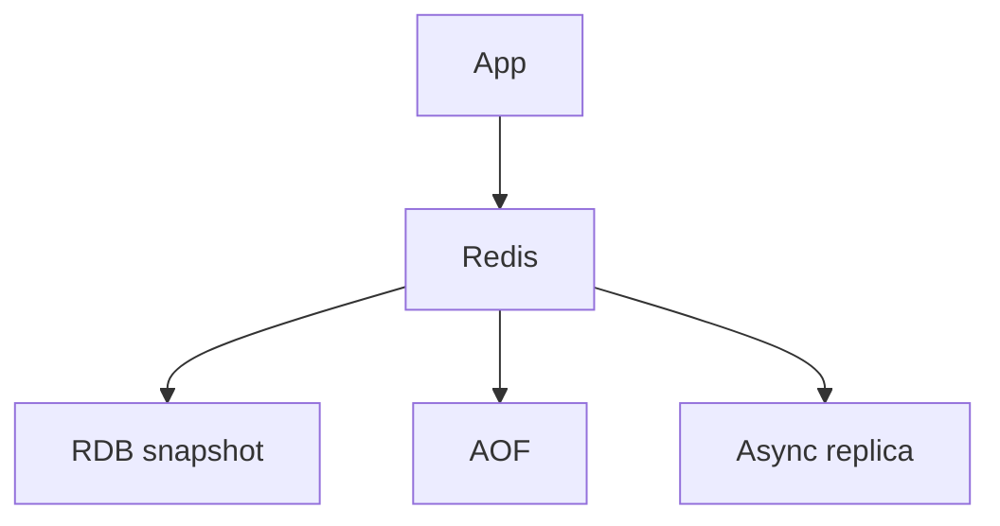

import { ConceptTemplate } from '@/features/kb/components/templates/ConceptTemplate'
import { Callout } from '@/features/kb/components/mdx/Callout'
import { ComparisonTable } from '@/features/kb/components/mdx/ComparisonTable'

export default function Layout({ children }) {
  return (
    <ConceptTemplate title="Redis">
      {children}
    </ConceptTemplate>
  )
}

**Redis** is an in-memory data structure server: strings, hashes, lists, sets, sorted sets, streams, and more. As a **cache**, it is Memcached-plus. As a **store**, you must choose persistence (RDB, AOF) and HA (replicas, Sentinel, Cluster) on purpose. The default mental model should stay "memory with optional disk."

## 1. Deep Dive and Mechanics

**Single-threaded command execution** (core). Commands are atomic. Throughput is high for small ops. Huge KEYS or big Lua blocks everyone. Use SCAN. Use Cluster to split.

**As cache.** maxmemory plus an eviction policy. TTLs on keys. Aside or write-through in the app.

**As lock.** SET NX PX. Still need a fence token for the Redlock debate; for a single instance, a token and short TTL are the usual job lock.

**Persistence.** RDB snapshots, AOF fsync every-second or always. everysec can lose a second on crash (PACELC: latency over durability).

<Callout icon="warning" title="A replica is async unless you wait">
WAIT and WAIT AOF exist. Default replication is async. Failover can lose the last writes. Do not put the only copy of money in Redis without a design review.
</Callout>

## 2. Mathematical / Theoretical Foundation

Memory is O(keys plus values plus overhead). Fragmentation exists. Cluster shards by hash slot (16384). Hot slots are the same hot-key problem as Kafka partitions.

Eviction plus persistence: an evicted key is gone even if AOF is on; AOF replays writes, not "all keys that used to exist."

<ComparisonTable
  headers={['Role', 'Config you must set', 'Failure']}
  rows={[
    ['Cache', 'maxmemory + policy + TTL', 'Stampede, stale'],
    ['Lock', 'NX + PX + token', 'Long critical section'],
    ['Queue / stream', 'MAXLEN, PEL', 'OOM'],
    ['Primary store', 'AOF, HA, backups', 'Data loss, ops load'],
  ]}
/>

## 3. Real-World Implementation

```python
r.set("user:42", json, ex=60)
r.get("user:42")
```

Pipeline small GETs. Avoid N+1 round trips. Prefer hashes for many tiny fields of one object.

## 4. Visualizations



## 5. Interview Prep

**Q: Redis versus Memcached?**
**A:** Redis if you need types, TTL ops, pub/sub, or optional persist. Memcached if you want a dumb slab cache and nothing else.

**Q: What does KEYS * do in prod?**
**A:** It walks the keyspace on the main thread and can stall the instance. Never. Use SCAN.

**Q: Cluster versus Sentinel?**
**A:** Sentinel: failover for one primary plus replicas. Cluster: shard slots across primaries. Different problems.

## 6. Production Use Cases

- **Session and rate-limit** counters.
- **Cache-aside** for SQL.
- **Streams** for modest job loads.

<Callout icon="tip" title="Decide cache versus store in the first sentence">
The rest of the Redis design (persist, HA, backup) follows from that sentence.
</Callout>
