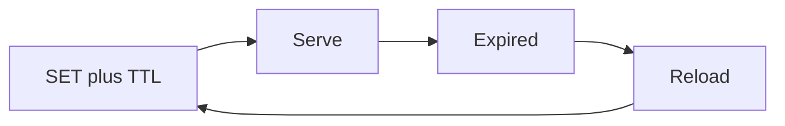

import { ConceptTemplate } from '@/features/kb/components/templates/ConceptTemplate'
import { Callout } from '@/features/kb/components/mdx/Callout'
import { ComparisonTable } from '@/features/kb/components/mdx/ComparisonTable'

export default function Layout({ children }) {
  return (
    <ConceptTemplate title="Time-To-Live (TTL)">
      {children}
    </ConceptTemplate>
  )
}

**TTL** (time-to-live) is how long a cached entry may be served before it expires. After expiry the next read misses (or serves stale if you designed that). TTL is the **staleness budget** and the **safety net** when a delete is forgotten.

## 1. Deep Dive and Mechanics

**Absolute versus sliding.** Absolute: expire at T after write. Sliding: expire at T after last read (session-style). Sliding can keep a hot stale value forever if you never write.

**Jitter.** Add a random extra few seconds so many keys do not expire in the same millisecond (stampede smear).

**Lazy versus active expiry.** Redis often expires on access and in a background sample. A key can sit past TTL until sampled. Do not assume a precise wall-clock drop.

**Negative TTL.** Cache misses briefly so the DB is not hammered for absent rows. Evict on create.

<Callout icon="info" title="TTL is not invalidation">
A price change at t=0 with TTL 3600 can be wrong for an hour. If that is too long, delete on write and keep a shorter TTL as backup.
</Callout>

## 2. Mathematical / Theoretical Foundation

If writes are Poisson and TTL is T, worst-case staleness is T. Expected staleness for a random read after a write is T/2 if the write did not evict.

Jitter uniform on [0, J] spreads expiry. Combined with locks, origin QPS stays near the miss rate, not the request rate.

<ComparisonTable
  headers={['TTL style', 'Expires', 'Use']}
  rows={[
    ['Absolute', 'Write time plus T', 'Catalog, pages'],
    ['Sliding', 'Last touch plus T', 'Sessions'],
    ['Jittered', 'T plus random', 'Hot key herds'],
    ['No TTL', 'Only eviction', 'Dangerous as cache'],
  ]}
/>

## 3. Real-World Implementation

```python
import random

def ttl_with_jitter(base, jitter):
    return base + random.randint(0, jitter)
```

Set both base and jitter from config. Log the key when you pick a 24h TTL for authz.

## 4. Visualizations



## 5. Interview Prep

**Q: How do you pick T?**
**A:** Max staleness the product accepts, then shorter if memory is tight. Measure miss QPS and origin capacity.

**Q: Why is a key still there after TTL?**
**A:** Lazy expiry, or you looked at the wrong Redis, or a write refreshed it. TTL on Redis is PTTL.

**Q: Sliding TTL for a cache of user profiles?**
**A:** A popular stale profile never dies. Use absolute TTL plus delete on write.

## 6. Production Use Cases

- **DNS** TTLs (a related idea at another layer).
- **Redis EXPIRE** on every cache-aside fill.
- **HTTP max-age** as the browser/CDN TTL.

<Callout icon="tip" title="Write TTL next to the key name">
"We cache users" is incomplete. "user:id for 45 seconds plus delete on PATCH" is a design.
</Callout>
