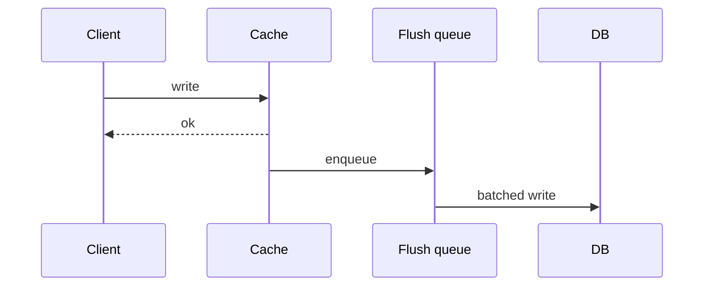

import { ConceptTemplate } from '@/features/kb/components/templates/ConceptTemplate'
import { Callout } from '@/features/kb/components/mdx/Callout'
import { ComparisonTable } from '@/features/kb/components/mdx/ComparisonTable'

export default function Layout({ children }) {
  return (
    <ConceptTemplate title="Write-Back Cache (Write-Behind)">
      {children}
    </ConceptTemplate>
  )
}

**Write-back** (write-behind) applies the write to the **cache first** and acknowledges the client. A **flusher** later writes the database. Reads see the cache. This is the CPU-cache story. In distributed systems it is a **durability bet**: if the cache node dies before flush, the write is gone unless you log it.

## 1. Deep Dive and Mechanics

**Why people want it.** Write-heavy APIs with a hot key (counters, last-seen). Batching many increments into one SQL UPDATE.

**The log.** Production write-back is a durable queue (Redis stream, WAL, Kafka) plus a cache. Memory-only write-back is a lab trick.

**Ordering.** Flushes must not apply an old value over a new one. Use versions or last-write-wins with care.

**Failure.** Cache down = cannot read the latest write even if the DB has an old copy. You need a story for both sides.

<Callout icon="error" title="If Redis is the only copy, you adopted Redis as the database">
Say that out loud. Then add AOF, HA, and backups — or do not use write-back for that key.
</Callout>

## 2. Mathematical / Theoretical Foundation

Ack latency is cache RTT, not DB fsync. RPO is the flush lag (seconds of writes). Throughput gain is batch size B: DB writes drop by about B if you coalesce.

PACELC: this is EL (latency) with a large RPO.

<ComparisonTable
  headers={['Pattern', 'Ack waits for DB', 'Loss on cache crash', 'Read after write']}
  rows={[
    ['Write-through', 'Yes', 'Low', 'Fresh'],
    ['Write-around', 'Yes', 'Low', 'Miss then stale risk'],
    ['Write-back', 'No', 'High unless logged', 'Fresh in cache'],
    ['Cache-aside', 'Yes (app write)', 'N/A', 'After DEL + read'],
  ]}
/>

## 3. Real-World Implementation

```python
def incr_views(cache, queue, video_id):
    cache.incr(f"views:{video_id}")
    queue.send(video_id)  # flusher will SUM into SQL
```

The flusher must be idempotent (set views = views + delta from a cursor).

## 4. Visualizations



## 5. Interview Prep

**Q: When is write-back OK?**
**A:** Counters and telemetry where losing a few seconds is fine, or when the queue is as durable as the DB. Not for billing without a WAL.

**Q: Write-around?**
**A:** Write DB only; cache fills on read. Avoids filling the cache with write-only junk. Next read is a miss.

**Q: How do you handle cache miss after a write-back write?**
**A:** You must not load the stale DB over the unflushed value. Read repair from the queue, or pin those keys to never miss (dangerous), or do not use write-back.

## 6. Production Use Cases

- **View counters** flushed every few seconds.
- **CPU and kernel** page caches (the namesake).
- **Session stores** that are explicitly Redis-as-DB.

<Callout icon="tip" title="Draw RPO in seconds">
If the number is not acceptable, you do not have a write-back design. You have write-through or aside.
</Callout>
