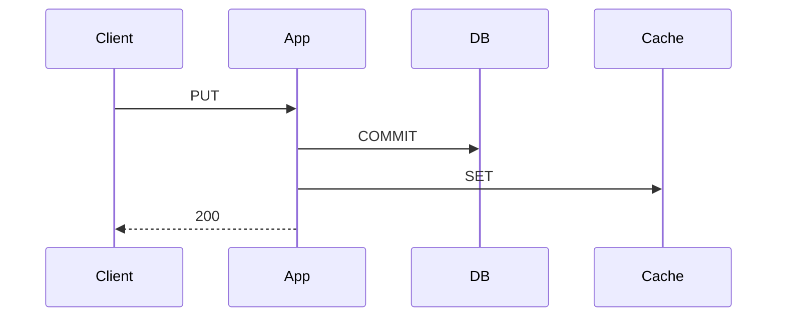

import { ConceptTemplate } from '@/features/kb/components/templates/ConceptTemplate'
import { Callout } from '@/features/kb/components/mdx/Callout'
import { ComparisonTable } from '@/features/kb/components/mdx/ComparisonTable'

export default function Layout({ children }) {
  return (
    <ConceptTemplate title="Write-Through Cache">
      {children}
    </ConceptTemplate>
  )
}

**Write-through** updates the **cache and the database** before the write API returns. The cache should already hold the new value, so the next read does not miss and does not see the old row. You pay **two waits** on the write path (or a transaction that includes both).

## 1. Deep Dive and Mechanics

**Order.** Write DB then cache, or cache then DB, or a transaction. DB-then-cache: a crash after DB leaves a stale cache until you retry SET. Cache-then-DB: a crash after cache leaves a value the DB never got (lie). Prefer **DB then SET**, and SET the value you committed, not a separate read.

**What you cache.** If you cannot build the full cached object from the write, SET is incomplete — DEL instead (aside). Write-through shines when the written blob is exactly what you cache.

**Write amplification.** Every write touches Redis, including keys nobody reads. That is wasted RAM and QPS. Aside only fills on read.

<Callout icon="info" title="Write-through is not a distributed transaction unless you make one">
A successful SQL COMMIT plus a failed Redis SET is stale until retry. Retry SET; do not pretend it is atomic.
</Callout>

## 2. Mathematical / Theoretical Foundation

Write latency is T_db plus T_cache (serial) or max if you pipeline after commit. Read latency after a successful write is T_cache.

Failure modes are partial commits. Idempotent SET retries close the window. TTL still bounds a lost SET.

<ComparisonTable
  headers={['Pattern', 'Write latency', 'Warm after write', 'Wasted fills']}
  rows={[
    ['Write-through', 'DB plus cache', 'Yes', 'Yes'],
    ['Write-back', 'Cache', 'Yes', 'Yes'],
    ['Cache-aside', 'DB plus DEL', 'No (miss later)', 'No'],
    ['Write-around', 'DB', 'No', 'No'],
  ]}
/>

## 3. Real-World Implementation

```python
def put_profile(db, cache, profile):
    db.save(profile)
    cache.set(f"profile:{profile.id}", profile, ttl=300)
```

Retry cache.set on failure. Metrics on retry count tell you when Redis is the write SLO.

## 4. Visualizations



## 5. Interview Prep

**Q: Write-through versus cache-aside?**
**A:** Through: next read is warm and fresh, writes are slower, unused keys occupy RAM. Aside: cheaper writes, first read misses, you must remember DEL.

**Q: Can the cache be ahead of the DB?**
**A:** If you SET before COMMIT, yes. Do not. SET after COMMIT.

**Q: ORM write-through?**
**A:** Hibernate/JPA second-level cache can write-through. Confirm the eviction on bulk SQL that bypasses the ORM.

## 6. Production Use Cases

- **Profiles** edited then immediately viewed.
- **Feature-flag** admin writes.
- **Read-through libraries** that also write-through on put.

<Callout icon="tip" title="Retry the SET as part of the handler">
A 200 to the client with a failed SET is a latent support ticket. Make SET failure visible.
</Callout>
